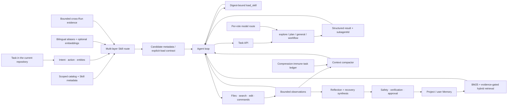

# CodeLoop

<p align="center">
  <strong>An evidence-driven local coding-agent runtime in Python.</strong>
</p>

<p align="center">
  Multi-layer Skill routing narrows the decision space. Long tasks retain critical state.
  Bounded sub-agents extend execution. Policy-qualified recoveries become reusable lessons.
</p>

<p align="center">
  <a href="./README.zh-CN.md">简体中文</a>
  ·
  <a href="./docs/PORTFOLIO_CASE_STUDY.en.md">3-minute case study</a>
  ·
  <a href="./docs/CONTRIBUTION_AUDIT.md">Full contribution map</a>
  ·
  <a href="./CONTRIBUTIONS.md">Contribution boundary</a>
  ·
  <a href="#quick-start">Quick start</a>
</p>

<p align="center">
  <a href="https://github.com/zrb3052796119/CodeLoop/actions/workflows/ci.yml"></a>
  
  
</p>

CodeLoop is a substantial derivative of
[MiniCode Python](https://github.com/QUSETIONS/MiniCode-Python), not a
from-scratch agent. It keeps the compatible `minicode` import path and
`minicode-py` executable, then extends and rebuilds parts of the runtime around
four questions:

1. Can Skills pass through layered directory/capability context, lexical and
   entity signals, bilingual aliases, optional embeddings, and bounded
   historical evidence—and still abstain when evidence is weak?
2. Can repeated context compaction preserve goals, facts, rejected approaches,
   tool-call integrity, and the latest instruction?
3. Can sub-agents be delegated work without losing lifecycle control,
   attribution, or a shared budget?
4. Can a verified tool failure become a safe lesson for the next conversation?

The short answer is **yes for the tested scopes**, with important limitations
documented below. The project favors inspectable evidence and fail-closed
contracts over broad capability claims.

These are four peer runtime-engineering tracks. The three-minute Memory case
is featured because it has the most complete warm/cold paired evidence; it is
one vertical slice, **not the scope of the whole project**.
Evaluation, configuration, privacy, and cross-platform reliability form a
support layer across them, not a fifth capability track.

> **Reuse notice:** this derivative repository currently has no root license,
> and the inspected Python upstream did not expose one. The code can be viewed
> and evaluated here, but public visibility is not a redistribution or
> commercial-use grant. See [Lineage and Credits](#lineage-and-credits).

## Portfolio Snapshot

| Item | Scope |
| --- | --- |
| Role | Maintainer and primary post-import Git author. Several commits carry AI co-author trailers; the history does not justify a “worked alone” or ownership-percentage claim. The exact upstream delta is not reconstructable because the imported baseline did not record an upstream revision. |
| Period | 2026-07-27 to present |
| Main ownership | Multi-layer Skill routing and bounded feedback, context-fidelity repairs, bounded sub-agent lifecycle/model routing, persistent-learning evidence loop, and evaluation/release discipline. |
| Status | Research/engineering prototype with a usable local CLI; not presented as a production-safe or generally benchmarked agent. |
| Hardest design choice | Make learned signals useful without granting authority: Skill history may only rerank independently admitted candidates, while Memory feedback may only affect entries actually rendered for that turn. |

## Evidence at a Glance

First, the contract surface for the four tracks and their support layer:

| System evidence | Result | What it does—and does not—show |
| --- | ---: | --- |
| [Repository regression suite](./.github/workflows/ci.yml) | **4,474 passed, 2 skipped** | Local Python 3.12 release run on 2026-08-24 against [runtime/test commit `4f7b53d`](https://github.com/zrb3052796119/CodeLoop/commit/4f7b53d); protects implemented behavior, not general agent intelligence. CI reruns the suite on a 3-OS × 2-Python matrix after push. |
| [Skill-routing gate](./docs/agent-quality-gates.md) | **60/60** | 40 positive/explicit plus 20 abstention/adversarial cases; top-1, abstention, and required-exact rates are 1.0. Offline with `remoteCallCount=0`, not live Qwen or an external benchmark. |
| [Repeated-compaction gate](./docs/agent-quality-gates.md) | **12/12** | Forced one-to-five-round cases cover summary chains, rejected approaches, the task ledger, latest instruction, loaded Skill, and tool turns. Proves the frozen contract, not zero drift in every long conversation. |
| [Recorded-task gate](./docs/agent-quality-gates.md) | **50/50** | Real model/runtime recordings from isolated synthetic repositories: 10 categories and 30 writing tasks. The command re-evaluates sealed evidence offline; profile `a` accepts fresh results for the same manifest but does not automatically rerun the provider. Not an external certification. |
| [Live parent/child model route](./docs/model-routing-live-acceptance-2026-08-23.md) | **4/4 actors × 2 rounds** | Parent, Explore, Plan, and General each made one HTTP request per round; outbound and provider-reported model IDs agreed. This is a sanitized curated projection, not a provider-signed receipt. |

### Memory Efficiency Vertical Slice

Here, **Memory / warm** is a new Run that receives the relevant approved
lesson; **cold** repeats the same task without it. Memory currently has the
most complete paired efficiency data, so it is listed separately:

| Paired/replay evidence | Result | What it does—and does not—show |
| --- | ---: | --- |
| [Paired path-recovery study](./docs/2026-08-21--persistent-memory-large-study--r1--robustness-check.md) | **48 Memory / cold pairs** | Reuse-stage target Turns: tools 50 vs 240 (**-79.2%**); input tokens 652,911 vs 1,539,738 (**-57.6%**). Lesson acquisition has an upfront cost. Synthetic, read-only recovery tasks only. |
| [Paired non-path study](./docs/2026-08-22--non-path-persistent-memory--r1--robustness-check.md) | **36 Memory / cold pairs** | Mean tools: 7.50 vs 11.50 (**-34.8%**); strict success: 32/36 vs 28/36. Results vary materially by lesson category. |
| [Large-file repair replay](./docs/north-star-memory-compaction-repairs-2026-08-21.md) | **5/5 run-external local oracles** | Model calls 25→5 and input tokens 257,088→49,541 in one stochastic replay. The oracles ran outside the Agent Run but were not third-party certification; useful fault-recovery evidence, not a causal effect estimate. |

Start with the [3-minute Memory case](./docs/PORTFOLIO_CASE_STUDY.en.md) for one
complete failure → recovery → lesson → next-conversation injection chain, then
use the linked reports to inspect the broader paired results. Its public
entry-ID join is a curated, hash-linked attestation; the privacy-held raw
sidecars are not included, so this is not an independently replayable proof of
the full provider trace.

## What Changed from the Imported Baseline

The initial imported repository already contained the main agent loop,
provider adapters, local tools, TUI, `CyberneticOrchestrator`, context
compaction, Memory, Skill routing, and a synchronous task/sub-agent tool.
CodeLoop should not claim those as original components.

| Area | CodeLoop work after the imported baseline | Verification surface |
| --- | --- | --- |
| Multi-layer Skill routing | On top of the inherited deterministic directory/Skill scorer: real abstention, bilingual intent and aliases, optional Qwen/OpenAI-compatible embeddings, strict explicit-invocation grammar, candidate-margin gates, digest-bound loading, and bounded cross-Run reranking that only affects independently admitted candidates. | Frozen 60-case bilingual/explicit/abstention/adversarial gate plus router, semantic cache/degradation, explicit grammar, digest-loader, and evidence tests. |
| Context fidelity | Added summary-of-summary chaining, a compression-immune ledger for goal/constraints/typed facts/failure codes, atomic provider tool turns, provider-usage calibration, and unchanged-state retry identity; connected forced paths to the inherited breaker. | Repeated-compaction gate and large-file replay. |
| Multi-agent runtime | Asynchronous `spawn` / `poll` / `cancel` for read-only `explore/plan`, structured results, `subagentId` journal joins, shared turn budgets, deadlines, and per-role OpenAI-compatible model routing. | Lifecycle, cancellation, result-schema, routing, journal, and budget tests. |
| Persistent Memory | On top of inherited storage, generic recovery synthesis, sanitization, approval, lexical retrieval/reranking, content hashes, and rendered-entry feedback: corroborated/idempotent feedback, quarantine/projection hygiene, broader operational recovery, canonical evidence-gated hybrid retrieval, and stricter acceptance attribution. | Paired warm/cold studies, V1–V5 deterministic contracts (V5 live/provider run pending), and the Memory regression matrix. |
| Cross-cutting support (not a fifth capability track) | Added global credential boundaries, privacy-safe failure projections, deterministic profiles, sealed manifests, and external oracles while hardening the inherited 3-OS × 2-Python CI, CLI/TUI/dashboard, and permission surfaces for Windows, concurrency, and deadline failures. | CI, local full-suite, clean-checkout, and live-routing checks. |

The [full contribution map](./docs/CONTRIBUTION_AUDIT.md) binds each track to
code, tests, and commits. The repository lineage and explicit
inherited/added/rebuilt inventory live in
[CONTRIBUTIONS.md](./CONTRIBUTIONS.md).

## How the Runtime Fits Together



The provider still decides which permitted tool to call. The surrounding
runtime records structured observations, constrains retries and delegation,
and only turns selected high-confidence outcomes into durable state.

## Core Capabilities

### 1. Multi-layer Skill routing that can abstain

The decision path is not “a regex matched, so inject the whole Skill.” The
runtime first discovers metadata from project, user, and compatibility roots,
then parses intent, action, entities, and bilingual keywords. Directory,
capability, tool, and source scores provide coarse ranking context; admission
still requires query-specific lexical/entity evidence, a bilingual alias, an
embedding above its signal threshold, or a strict explicit invocation. Weak
evidence is limited to the strongest suggestion. With no evidence, the router
selects nothing and the prompt retains only a name-only inventory—not rich
candidate descriptions or tool metadata.

The optional semantic layer supports Qwen/DashScope and other
OpenAI-compatible embedding endpoints. Skill vectors are cached by content
digest; provider failures enter a shared cooldown and degrade to the local
alias floor. Explicit `$skill`, English `Use ... Skill`, and Chinese invocation
grammar outrank inferred signals, while negated references and ordinary name
collisions gain no authority. An explicitly requested Skill must be loaded
before the final answer. Loading is bound to the discovered source, directory,
path, and SHA-256 digest, preventing route-old/load-new drift, ambiguous bare
names, and symlink escape.

Cross-Run evidence may apply a capped rank adjustment only after strict sample,
verification, user-signal, and confidence gates—and only to a candidate that
the current query admitted independently. It cannot create relevance, defeat
abstention, override an explicit request, rewrite a Skill, or promote a new
version. The frozen 60-case gate covers 40 positive/explicit and 20
abstention/adversarial cases and currently records 60/60 with
`remoteCallCount=0`. It validates the deterministic routing contract; it is
not a live Qwen call. Transport mocks, cache/degradation tests, and a separate
smoke path cover the remote adapter boundary.

See [Skill routing feedback](./docs/skill-routing-feedback.md) and the
[full contribution map](./docs/CONTRIBUTION_AUDIT.md).

### 2. Context compaction that preserves task state

CodeLoop uses one canonical compaction path. It preserves provider-native
tool-call/result pairs, chains each new summary through the previous summary,
and re-injects the latest user instruction. A parent-owned task ledger keeps a
bounded goal, explicit constraints, typed verification facts, and failed-tool
error codes outside the lossy summary cycle. It does not semantically infer a
complete project plan or arbitrary open work. Provider-reported usage
calibrates the local estimator when available.

The frozen gate also carries a rejected-approach summary sentinel through
repeated rounds. That state is preserved by the summary chain; it is not a
claim that the task ledger infers or maintains an arbitrary decision history.

Failed compactions are keyed to the unchanged message state, deduplicated, and
bounded by a circuit breaker. A materially changed state may retry; an
unchanged state cannot oscillate indefinitely.

See [context repair report](./docs/north-star-memory-compaction-repairs-2026-08-21.md)
and [quality-gate contract](./docs/agent-quality-gates.md).

### 3. Bounded multi-agent collaboration

Four task roles are available:

| Role | Typical work | Lifecycle |
| --- | --- | --- |
| `explore` | Read-only repository discovery | May run asynchronously with `spawn` / `poll` / `cancel`. |
| `plan` | Read-only analysis and implementation planning | May run asynchronously with the same lifecycle. |
| `general` | Focused delegated implementation or analysis | Synchronous; may receive write-capable tools. |
| `workflow` | Versioned review/decision workflow | Synchronous and fail-closed on malformed verdicts. |

Every child shares the parent turn budget. General results use a structured
`summary / files / risks / verification` envelope and completion events carry
a stable `subagentId`. Cancellation is cooperative: it stops queued/future
work, but it cannot forcibly kill a Python thread already blocked inside a
provider socket call.

An optional dedicated OpenAI-compatible route can send child roles to a
lighter model such as `qwen3.6-flash` while the parent keeps the primary model.
That model name is an illustrative configuration, not the route covered by the
checked-in live acceptance, which used `qwen3.7-plus` and `qwen3.7-max`.
See [sub-agent model routing](./docs/subagent-model-routing.md).

### 4. Persistent lessons with a real evidence chain

The Memory write path is not “save the model's summary.” A durable recovery
lesson must be derived from structured events that connect a failed action to
a corrected action and a policy-qualified successful result. Automatic
approval is limited to strong recovery signals; ambiguous claims remain
pending or are rejected. “Verified recovery” can mean targeted corrected-tool
evidence and is not always an independent test command—the featured case makes
that distinction explicit. Stored entries are content-hash bound, sanitized,
auditable, and can be quarantined or downgraded by later feedback.

On the read path, canonical retrieval combines lexical evidence with an
optional hybrid channel. Remote Memory embeddings require a separate explicit
authorization because approved lessons may leave the machine. Rendered Memory
records exact entry IDs so later success or correction can be attributed to
what was actually injected.

See [Memory hybrid retrieval](./docs/memory-hybrid-retrieval.md),
[large paired study](./docs/2026-08-21--persistent-memory-large-study--r1--robustness-check.md),
and [non-path paired study](./docs/2026-08-22--non-path-persistent-memory--r1--robustness-check.md).

## Quick Start

### 1. Install CodeLoop

macOS / Linux:

```bash
git clone https://github.com/zrb3052796119/CodeLoop.git
cd CodeLoop
python3 -m venv .venv
source .venv/bin/activate
python -m pip install -e ".[dev]"
```

Windows PowerShell:

```powershell
git clone https://github.com/zrb3052796119/CodeLoop.git
Set-Location CodeLoop
py -3.12 -m venv .venv
& .\.venv\Scripts\Activate.ps1
python -m pip install -e ".[dev]"
```

### 2. Create one global model configuration

macOS / Linux:

```bash
mkdir -p ~/.mini-code
chmod 700 ~/.mini-code
cp .env.example ~/.mini-code/.env
chmod 600 ~/.mini-code/.env
```

Windows PowerShell:

```powershell
$configDir = Join-Path $HOME ".mini-code"
New-Item -ItemType Directory -Force $configDir
Copy-Item .env.example (Join-Path $configDir ".env")
```

Edit `~/.mini-code/.env` and enable exactly one primary provider profile. The
checked-in example covers Anthropic, OpenAI, OpenRouter, and custom
OpenAI-compatible endpoints. Never commit a real key.

```bash
python -m minicode.main --validate-config
```

The untouched example deliberately has no active credential and must fail
until edited. Validation checks local structure and safety rules; it does not
make a provider request or prove that the credential authenticates remotely.

Process environment variables take precedence. The legacy
`~/.mini-code/settings.json` remains a compatibility fallback. A target
project's `.env` is deliberately ignored for primary-model, embedding, and
sub-agent endpoint credentials, so an untrusted repository cannot redirect a
globally owned key. Use `/config-paths` in the CLI to inspect active sources.

### 3. Run it inside the project you want to edit

macOS / Linux:

```bash
source /path/to/CodeLoop/.venv/bin/activate
cd /path/to/your/project
minicode-py
```

Windows PowerShell:

```powershell
& C:\path\to\CodeLoop\.venv\Scripts\Activate.ps1
Set-Location C:\path\to\your\project
minicode-py
```

The **current working directory is the target project**. CodeLoop itself does
not need to be copied into that repository after installation. Because this is
an editable virtual-environment install, activate CodeLoop's `.venv` in each
new terminal and do not move or delete the clone without reinstalling. You can
also start it with `python -m minicode.main` from the active environment.

For a safe first turn, try:

```text
Review this repository's architecture and main risks. Do not modify files.
```

CodeLoop asks for approval before protected actions. Inspect the exact command
or path and choose allow or deny; approval is not a substitute for a disposable
branch or container when working on untrusted code. Enter `/exit` to leave the
interactive CLI.

### Optional: route sub-agents to Qwen

In `~/.mini-code/.env`, replace the existing three sub-agent lines; do not
append duplicate keys because duplicate configuration is rejected:

```dotenv
MINI_CODE_SUBAGENT_API_KEY=replace-me
MINI_CODE_SUBAGENT_BASE_URL=https://dashscope.aliyuncs.com/compatible-mode/v1
MINI_CODE_SUBAGENT_MODEL=qwen3.6-flash
```

The credential is separate from the parent and embedding keys. If it is empty,
children inherit the parent model for compatibility. `qwen3.6-flash` is an
illustrative choice; the checked-in public live acceptance covers
`qwen3.7-plus` / `qwen3.7-max`. Per-role overrides are documented in
[sub-agent model routing](./docs/subagent-model-routing.md).

### Optional: enable hybrid Memory retrieval

Hybrid retrieval is disabled by default and requires promotion evidence. A
local E5 route keeps **embeddings** on-device, but an enabled LLM
verifier/challenger can still send the query and candidate Memory text/metadata
to its configured provider. A Qwen embedding route additionally requires
`MINI_CODE_ALLOW_REMOTE_MEMORY_EMBEDDING=true`. Follow the complete privacy,
provider, model-path, and evidence-file procedure in
[Memory hybrid retrieval](./docs/memory-hybrid-retrieval.md).

## Verification

Run the same focused checks used during release preparation:

```bash
python -m compileall -q minicode scripts
python -m ruff check minicode/ --select=E,F --ignore=E501
python scripts/evaluate_agent_quality.py --profile current
python scripts/evaluate_agent_quality.py --profile a
python -m pytest -q
```

Both quality profiles make no remote model calls. `current` pins fixture,
manifest, and recorded-result hashes. Profile `a` pins its fixture/manifest
contract but intentionally accepts fresh matching results; the default command
evaluates the checked-in recording. `current` is the CI regression profile;
`a` is the declared internal promotion threshold. The 50 recorded north-star cases span 10 categories and
include 30 workspace-writing tasks. A fresh provider run can be supplied to
the same sealed manifest, but the checked-in gate itself does not replay those
tasks.

GitHub Actions runs installation, compilation, scoped Ruff checks, packaging
smoke tests, the deterministic `current` gate, and the full suite on Linux,
macOS, and Windows with Python 3.11 and 3.12.

## Repository Guide

| Path | Purpose |
| --- | --- |
| `minicode/` | Canonical runtime package used by installation and tests. |
| `tests/` | Unit, integration, adversarial, acceptance-contract, and regression tests. |
| `scripts/` | Quality gates, live runners, analyzers, and frozen-manifest builders. |
| `artifacts/` | Curated public manifests/results; raw journals, workspaces, and local Memory are ignored. |
| `docs/` | Architecture notes, experiment reports, acceptance audits, and usage guides. |
| `py-src/` | Legacy/reference tree; it is not the package installed by `pyproject.toml`. |

Useful entry points:

- [Four-track contribution map](./docs/CONTRIBUTION_AUDIT.md)
- [3-minute portfolio case](./docs/PORTFOLIO_CASE_STUDY.en.md)
- [Contribution and lineage boundary](./CONTRIBUTIONS.md)
- [Usage guide](./docs/USAGE_GUIDE.md)
- [Agent quality gates](./docs/agent-quality-gates.md)
- [Memory repair contract history (V5 live pending)](./docs/persistent-memory-repair-acceptance-2026-08-23.md)
- [Model-routing live acceptance](./docs/model-routing-live-acceptance-2026-08-23.md)
- [Optimization history](./docs/OPTIMIZATION_SUMMARY.md)

## Honest Limitations

- The 60-case Skill gate is a frozen offline routing contract. It makes no
  remote embedding calls and is not a set of 60 real-project tasks; the
  optional Qwen embedding route is not a live benchmark on that basis.
- The strongest efficiency results come from synthetic repositories. They
  demonstrate mechanisms under controlled conditions, not universal coding
  productivity gains.
- Path-recovery lessons are mature in the tested scope; command and verification
  lessons are promising; abstract project-constraint Memory remains a negative
  result in the current paired study.
- The V5 post-fix provider acceptance run is still pending. Deterministic tests
  are green, while the latest completed V4 provider run passed 7/10 cases and
  84/91 oracles with 10/10 exact Memory attribution.
- Asynchronous lifecycle is limited to read-only `explore` and `plan` roles.
  Cancellation is cooperative, not process isolation.
- CodeLoop has approval and path/credential boundaries, but it is **not an OS
  sandbox**. Run it in a disposable branch or container when evaluating
  unfamiliar tasks.
- Model providers can receive the prompt and relevant repository content.
  Review provider data policies before using private code.
- The repository currently has no root license file. The inspected Python
  upstream also did not expose one; public source visibility is not a license.
  Confirm reuse terms before redistribution or commercial use.

## Lineage and Credits

- Python upstream: [QUSETIONS/MiniCode-Python](https://github.com/QUSETIONS/MiniCode-Python)
- MiniCode TypeScript project: [LiuMengxuan04/MiniCode](https://github.com/LiuMengxuan04/MiniCode)
- Imported repository baseline: [`3036dd7`](https://github.com/zrb3052796119/CodeLoop/commit/3036dd76e4ca676541a79a64dc6d24ec20baf433)

For an auditable description of what was inherited, added, or materially
rebuilt, read [CONTRIBUTIONS.md](./CONTRIBUTIONS.md).
