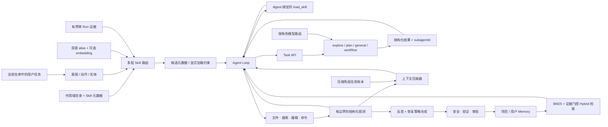

# CodeLoop

<p align="center">
  <strong>一个以证据闭环为核心的 Python 本地 Coding Agent Runtime。</strong>
</p>

<p align="center">
  先用多层 Skill 路由缩小决策空间；让长任务在多轮压缩后保留关键状态；
  用有边界的子 Agent 扩展执行；把满足证据策略的恢复沉淀为跨会话经验。
</p>

<p align="center">
  <a href="./README.md">English</a>
  ·
  <a href="./docs/PORTFOLIO_CASE_STUDY.md">3 分钟案例</a>
  ·
  <a href="./docs/CONTRIBUTION_AUDIT.md">完整贡献图谱</a>
  ·
  <a href="./CONTRIBUTIONS.md">贡献边界</a>
  ·
  <a href="#快速开始">快速开始</a>
</p>

<p align="center">
  <a href="https://github.com/zrb3052796119/CodeLoop/actions/workflows/ci.yml"></a>
  
  
</p>

CodeLoop 是 [MiniCode Python](https://github.com/QUSETIONS/MiniCode-Python)
的深度衍生版本，**不是从零实现的 Coding Agent**。项目保留了兼容的
`minicode` 导入路径与 `minicode-py` 命令，在此基础上重点重构和扩展了四条链路：

1. Skill 能否经过“目录/能力上下文 → 词法与实体 → 双语 alias → 可选 embedding → 有界历史证据”多层路由，并在证据不足时真正弃权？
2. 多轮上下文压缩后，目标、已验证事实、被否方案、工具调用完整性和最新指令能否继续保真？
3. 主 Agent 能否把任务交给子 Agent，同时仍掌握生命周期、归因和共享预算？
4. 一次已经验证的工具失败，能否安全地变成下一次新对话可复用的经验？

在已测试范围内，答案是“可以”；超出实验范围的部分则明确列在本文末尾。这个项目追求的是**可检查的运行证据、可复现的质量门和失败时的保守退化**，而不是宽泛的能力口号。

这四条是并列的 Runtime 工程主线。本文中的 3 分钟 Memory 案例只是因为它具备
最完整的 warm/cold 配对数据而被选作一个纵切面，**不代表项目只改了持久化记忆**。
另有一层评测、配置、隐私和跨平台可靠性作为横向工程支撑，不算第五条能力主线。

> **复用提示：**这个衍生仓库当前没有根目录 LICENSE，检查到的 Python
> 上游也没有公开许可证。代码可以在此查看和评审，但公开可见不等于获得重新分发
> 或商业使用授权。详见[上游与致谢](#上游与致谢)。

## 项目履历快照

| 项目 | 范围 |
| --- | --- |
| 角色 | 维护者与导入后的主要 Git 作者；部分提交带 AI co-author trailer，因此不宣称“完全独立完成”或个人占比。初始导入没有记录精确上游 revision，不能精确复原 upstream diff。 |
| 时间 | 2026-07-27 至今 |
| 主要负责 | Skill 多层路由与有界反馈、上下文保真修复、有边界子 Agent 生命周期/模型路由、持久化经验闭环，以及评测发布纪律。 |
| 当前状态 | 可实际使用本地 CLI 的工程/研究原型；不宣称达到生产安全或通用 benchmark 领先。 |
| 最难设计决策 | 让学习信号有用但不夺权：Skill 历史证据只能重排已独立准入的候选；Memory 反馈只能归因到当轮实际渲染的条目。 |

## 30 秒看懂证据

先看四条主线和横向支撑各自受什么合同约束：

| 系统证据 | 结果 | 能说明什么，不能说明什么 |
| --- | ---: | --- |
| [仓库回归测试](./.github/workflows/ci.yml) | **4,474 passed, 2 skipped** | 2026-08-24 在 Python 3.12 对 [Runtime/测试提交 `4f7b53d`](https://github.com/zrb3052796119/CodeLoop/commit/4f7b53d) 完成的本地发布验收；说明已实现行为受到回归保护，不代表通用 Agent 智能。推送后 CI 会在 3 OS × 2 Python 矩阵重跑。 |
| [Skill 路由门禁](./docs/agent-quality-gates.md) | **60/60** | 40 个正例/显式调用 + 20 个弃权/对抗负例；top-1、弃权和 required exact 均为 1.0。离线、`remoteCallCount=0`，不是 live Qwen 或第三方 benchmark。 |
| [重复压缩门禁](./docs/agent-quality-gates.md) | **12/12** | 对 1–5 轮强制压缩检查摘要链、被否方案、任务账本、最新指令、已加载 Skill 和工具轮次。证明冻结合同，不证明任意长会话都无语义漂移。 |
| [记录任务门禁](./docs/agent-quality-gates.md) | **50/50** | 10 类、30 个写任务的真实模型/Runtime 运行记录来自隔离合成仓库；当前命令只离线复验冻结记录，`a` 接受同 manifest 的新结果，不会自动重跑 provider，也不是第三方认证。 |
| [主/子模型 live 路由](./docs/model-routing-live-acceptance-2026-08-23.md) | **4/4 actors × 2 轮** | Parent、Explore、Plan、General 每轮各一次 HTTP 请求，出站与 provider 回报 model 一致；这是脱敏策展投影，不是 provider 签名回执。 |

### Memory 效率纵切面

这里的 **Memory / warm** 指一个注入相关已批准经验的新 Run；**cold** 指相同任务
不提供这条经验。Memory 拥有目前最完整的成对效率数据，因此单独列出：

| 配对/回放证据 | 结果 | 能说明什么，不能说明什么 |
| --- | ---: | --- |
| [路径恢复配对实验](./docs/2026-08-21--persistent-memory-large-study--r1--robustness-check.md) | **48 对 Memory / cold** | 仅比较复用阶段的目标 Turn：工具调用 50 vs 240（**-79.2%**）；输入 token 652,911 vs 1,539,738（**-57.6%**）。首次学习有前置成本；任务仅为合成、只读恢复。 |
| [非路径经验配对实验](./docs/2026-08-22--non-path-persistent-memory--r1--robustness-check.md) | **36 对 Memory / cold** | 平均工具 7.50 vs 11.50（**-34.8%**）；严格成功 32/36 vs 28/36。不同经验类别差异明显。 |
| [大文件修复回放](./docs/north-star-memory-compaction-repairs-2026-08-21.md) | **5/5 Run 外本地 oracle** | 单次随机回放中模型调用 25→5、输入 token 257,088→49,541；oracle 位于 Agent Run 外但不是第三方认证，结果说明故障环消失，不能当作稳定因果效应。 |

如果只看一个运行链路，先看 [3 分钟 Memory 案例](./docs/PORTFOLIO_CASE_STUDY.md)：
它串起了“错误工具调用 → 找到正确方法 → 验证 → 生成经验 → 新对话检索注入 →
减少重复探索”的完整证据链，然后再链接到更大规模的配对实验。公开的 entry-ID
join 是经过策展、带源哈希的 attestation；隐私 sidecar 未公开，因此它不是一份可由
第三方独立重放完整 provider trace 的证明。

## 相比导入基线，我改了什么

仓库最初导入的版本已经具备主 Agent Loop、模型适配器、本地工具、TUI、
`CyberneticOrchestrator`、上下文压缩、Memory、Skill 路由，以及同步的
task/子 Agent 工具。这些不能被描述成 CodeLoop 从零新增的模块。

| 方向 | 导入基线之后的 CodeLoop 工作 | 证据面 |
| --- | --- | --- |
| Skill 多层路由 | 在基线已有目录/Skill 确定性评分器之上，新增真正弃权、双语意图与 alias、可选 Qwen/OpenAI-compatible embedding、严格显式点名语法、候选幅度门、digest 绑定加载，以及只对已独立准入候选生效的跨 Run 有界重排。 | 冻结的 60 例中英双语/显式调用/弃权/对抗门禁；router、semantic cache/degradation、显式语法、digest loader 和 evidence tests。 |
| 上下文保真 | summary-of-summary 摘要链；保存目标/显式约束/typed fact/失败码的压缩免疫账本；原子 provider 工具轮次、usage 校准、未变化状态重试身份；让强制路径遵守基线已有熔断器。 | 重复压缩门禁和大文件回放。 |
| 多 Agent Runtime | 面向只读 `explore/plan` 的异步 `spawn` / `poll` / `cancel`、结构化结果、`subagentId` 日志 join、共享 Turn 预算、deadline 与按角色模型路由。 | 生命周期、取消、结果协议、路由、日志与预算测试。 |
| 持久化经验 | 在基线已有存储、通用恢复合成、sanitizer、审批、词法检索/重排、内容哈希和渲染反馈之上，强化 corroborated/idempotent 反馈、隔离与投影卫生、操作恢复、canonical Hybrid 检索和验收归因。 | warm/cold 配对实验、V1–V5 确定性合同（V5 live/provider 运行待执行）和 Memory 回归矩阵。 |
| 横向工程支撑（非第五条能力主线） | 在基线已有 3 OS × 2 Python CI、CLI/TUI/Dashboard 和权限流上，增加全局凭据边界、隐私安全失败投影、确定性质量档位、冻结 manifest、外部 oracle，并持续修复 Windows/并发/期限问题。 | CI、本地全量验证、clean-checkout 和 live 路由检查。 |

更细的继承/新增/实质重构清单与提交谱系见
[完整贡献图谱](./docs/CONTRIBUTION_AUDIT.md)和
[CONTRIBUTIONS.md](./CONTRIBUTIONS.md)。

## 系统如何协作



模型仍然负责选择下一步允许的工具。外围 Runtime 负责记录结构化观测、约束重试与委派，并且只把满足强证据条件的结果变成长期状态。

## 四项核心能力

### 1. 会弃权、可审计的多层 Skill 路由

当前决策链不是“正则命中就把 Skill 全文塞进 prompt”。Runtime 先发现 project、
user 和兼容目录中的 Skill 元数据，再解析意图、动作、实体与中英关键词；目录、能力、
工具和来源只提供粗粒度排序上下文，真正准入还必须来自与当前查询相关的词法、实体、
双语 alias、达到阈值的 embedding，或用户的严格显式点名。弱证据只保留最强的一个
建议；证据不足时路由结果为空，仅保留 name-only 目录帮助模型发现可用 Skill，不注入
候选描述、工具等富元数据。

可选语义层兼容 Qwen/DashScope 的 OpenAI-compatible embedding 接口。Skill 向量按
内容 digest 缓存；provider 失败后走共享冷却并退化到本地 alias，而不是拖垮每一轮路由。
显式 `$skill`、`Use ... Skill` 与中英文调用语法拥有最高优先级，否定句和普通同名词不获得
这项权限。被显式点名的 Skill 在最终回答前必须 `load_skill`；加载路径绑定发现快照中的
source、目录、文件和 SHA-256 digest，避免 route-old/load-new 漂移、歧义名和符号链接逃逸。

跨 Run 证据只能在严格样本、验证、用户信号和置信门通过后，对**已经独立准入**的候选做
有上限的排序调整；它不能制造相关性、打破弃权、覆盖显式请求、改写 Skill 正文或自动晋升
新版本。冻结的 60 例门禁覆盖 40 个正例/显式调用和 20 个弃权/对抗负例，当前记录为
60/60、`remoteCallCount=0`。因此它验证的是确定性路由合同，不应被表述为 CI 真实调用了
Qwen；远程路径由 transport mock、cache/degradation 测试和单独 smoke 覆盖。

继续阅读：[Skill 路由反馈](./docs/skill-routing-feedback.md)、
[完整贡献图谱](./docs/CONTRIBUTION_AUDIT.md)。

### 2. 不丢任务状态的上下文压缩

CodeLoop 使用一条 canonical 压缩路径。它不会拆开 provider 原生的工具调用/结果对；每一轮新摘要都会吸收上一轮摘要，并重新插入最新用户指令。父 Agent 持有的任务账本将有界目标、显式约束、typed verification fact 和失败工具错误码放在有损摘要周期之外；它不会语义推断完整计划或任意 open work。provider 返回真实 usage 时，本地 token 估计会据此校准。

冻结门禁还把“被否方案”作为摘要保真 sentinel 跨多轮检查；它由摘要链保存，
不被夸大成任务账本会自动推断和维护任意方案历史。

压缩失败会按“策略 + 未变化的消息状态”去重，并受熔断器限制；内容发生实质变化后才允许重试，原地不变的状态不能无限振荡。

继续阅读：[上下文修复报告](./docs/north-star-memory-compaction-repairs-2026-08-21.md)、
[质量门合同](./docs/agent-quality-gates.md)。

### 3. 有边界的多 Agent 协作

目前有四种 task 角色：

| 角色 | 典型工作 | 生命周期 |
| --- | --- | --- |
| `explore` | 只读探索仓库 | 可通过 `spawn` / `poll` / `cancel` 异步运行。 |
| `plan` | 只读分析与实现计划 | 可使用同一套异步生命周期。 |
| `general` | 聚焦的实现或分析委派 | 同步执行，可以获得写工具。 |
| `workflow` | 带版本协议的 review/decision 工作流 | 同步执行；裁决格式错误时 fail-closed。 |

每个子 Agent 与父 Agent 共享同一份 Turn 预算。通用结果使用
`summary / files / risks / verification` 结构，完成事件携带稳定
`subagentId`，便于日志、结果和父任务三方 join。取消是协作式的：它能阻止排队中和后续工作，但不能强杀一个已经阻塞在 provider socket 内的 Python 线程。

可选的 OpenAI-compatible 独立路由可以让子 Agent 使用 `qwen3.6-flash`
等轻量模型，同时父 Agent 保留更强主模型。该名称是配置示例；仓库公开的 live
验收覆盖的是 `qwen3.7-plus` 与 `qwen3.7-max`，不是这个示例。详见
[子 Agent 模型路由](./docs/subagent-model-routing.md)。

### 4. 有真实证据链的持久化经验

Memory 写入不是“把模型总结存下来”。一条可持久化的恢复经验必须能从结构化事件中证明：某个动作失败，随后出现了与它对应的修正动作，并且修正结果满足恢复策略。只有强恢复信号能够自动批准；模糊 claim 保持 pending 或被拒绝。这里的 verified recovery 可能指 targeted corrected-tool evidence，并不总是独立测试命令，案例文档会明确区分。条目会做内容哈希绑定、安全清洗和审计，后续还可以根据负反馈降权、拒绝或隔离。

读取侧的 canonical retrieval 将词法证据与可选 Hybrid 通道组合。远程 Memory embedding 需要单独显式授权，因为已批准的经验可能离开本机。每次真实渲染都会记录精确 entry ID，因此后续成功或用户纠偏能够归因到“当时到底注入了哪条经验”。

继续阅读：[Hybrid Memory 检索](./docs/memory-hybrid-retrieval.md)、
[路径恢复大样本](./docs/2026-08-21--persistent-memory-large-study--r1--robustness-check.md)、
[非路径经验实验](./docs/2026-08-22--non-path-persistent-memory--r1--robustness-check.md)。

## 快速开始

### 1. 安装 CodeLoop

macOS / Linux：

```bash
git clone https://github.com/zrb3052796119/CodeLoop.git
cd CodeLoop
python3 -m venv .venv
source .venv/bin/activate
python -m pip install -e ".[dev]"
```

Windows PowerShell：

```powershell
git clone https://github.com/zrb3052796119/CodeLoop.git
Set-Location CodeLoop
py -3.12 -m venv .venv
& .\.venv\Scripts\Activate.ps1
python -m pip install -e ".[dev]"
```

### 2. 只配置一次全局主模型

macOS / Linux：

```bash
mkdir -p ~/.mini-code
chmod 700 ~/.mini-code
cp .env.example ~/.mini-code/.env
chmod 600 ~/.mini-code/.env
```

Windows PowerShell：

```powershell
$configDir = Join-Path $HOME ".mini-code"
New-Item -ItemType Directory -Force $configDir
Copy-Item .env.example (Join-Path $configDir ".env")
```

编辑 `~/.mini-code/.env`，只启用一种主模型 provider 配置。仓库提供的示例覆盖 Anthropic、OpenAI、OpenRouter 和自定义 OpenAI-compatible 端点。不要提交真实密钥。

```bash
python -m minicode.main --validate-config
```

未修改的示例故意没有启用真实凭据，必须在编辑后才能通过。这个命令只检查本地结构与安全规则，不会调用 provider，也不能证明远程密钥真实有效。

进程环境变量优先级最高；旧的 `~/.mini-code/settings.json` 仍作为兼容回退。目标项目自己的 `.env` 不会参与主模型、embedding 或子 Agent 端点/凭据路由，因此打开一个不受信任的仓库不能重定向全局持有的密钥。可以在 CLI 中运行 `/config-paths` 查看真实配置来源。

### 3. 在你真正想修改的项目目录中启动

macOS / Linux：

```bash
source /path/to/CodeLoop/.venv/bin/activate
cd /path/to/your/project
minicode-py
```

Windows PowerShell：

```powershell
& C:\path\to\CodeLoop\.venv\Scripts\Activate.ps1
Set-Location C:\path\to\your\project
minicode-py
```

**当前工作目录就是 CodeLoop 要读取和修改的目标项目。** 安装以后，不需要把 CodeLoop 源码复制进每个项目。这里使用的是 editable virtualenv 安装，所以每个新终端都要先激活 CodeLoop 的 `.venv`；如果移动或删除 clone，需要重新安装。也可以在已激活环境中使用 `python -m minicode.main` 启动。

第一次使用建议先输入一个只读任务：

```text
评审这个仓库的架构和主要风险，先不要修改文件。
```

受保护操作执行前会出现审批提示。请核对准确的命令或路径后再允许或拒绝；面对陌生代码，审批不能替代临时分支、容器或可丢弃环境。输入 `/exit` 退出交互式 CLI。

### 可选：把子 Agent 路由到 Qwen

在 `~/.mini-code/.env` 中替换已有的三行子 Agent 配置，不要在文件末尾重复追加；重复 key 会被拒绝：

```dotenv
MINI_CODE_SUBAGENT_API_KEY=replace-me
MINI_CODE_SUBAGENT_BASE_URL=https://dashscope.aliyuncs.com/compatible-mode/v1
MINI_CODE_SUBAGENT_MODEL=qwen3.6-flash
```

这份凭据与父 Agent、embedding key 相互独立。key 为空时，子 Agent 为了兼容会继承父模型。`qwen3.6-flash` 是可替换的配置示例；当前公开 live 验收覆盖 `qwen3.7-plus` / `qwen3.7-max`。按角色覆盖模型的方法见
[子 Agent 模型路由](./docs/subagent-model-routing.md)。

### 可选：启用 Hybrid Memory 检索

Hybrid 默认关闭，并且要求通过 promotion evidence。local E5 路由只保证 embedding 在本机；如果启用 LLM verifier/challenger，query 和候选 Memory 文本/元数据仍可能发送给其 provider。Qwen embedding 路由还必须额外设置
`MINI_CODE_ALLOW_REMOTE_MEMORY_EMBEDDING=true`。完整的隐私授权、provider、模型路径与证据文件配置见
[Hybrid Memory 检索](./docs/memory-hybrid-retrieval.md)。

## 如何验证

发布前使用以下命令做聚焦验证：

```bash
python -m compileall -q minicode scripts
python -m ruff check minicode/ --select=E,F --ignore=E501
python scripts/evaluate_agent_quality.py --profile current
python scripts/evaluate_agent_quality.py --profile a
python -m pytest -q
```

两档质量门都不会调用远程模型。`current` 固定 fixture、manifest 和记录结果哈希；`a` 固定 fixture/manifest 合同，但有意接受同一 manifest 的新结果，默认命令评估仓库中的记录结果。`current` 是 CI 回归档，`a` 是项目声明的内部晋级阈值。50 个记录的 north-star case 覆盖 10 类任务，其中 30 个会写工作区。仓库自带门禁不会假装重新执行这 50 个任务。

GitHub Actions 会在 Linux、macOS、Windows 和 Python 3.11/3.12 矩阵上执行安装、编译、限定范围 Ruff、打包 smoke、确定性 `current` 门禁和全量测试。

## 仓库导航

| 路径 | 作用 |
| --- | --- |
| `minicode/` | 安装与测试使用的 canonical Runtime 包。 |
| `tests/` | 单元、集成、对抗、验收合同和回归测试。 |
| `scripts/` | 质量门、live runner、分析器与冻结 manifest 构建器。 |
| `artifacts/` | 策展后的公开 manifest/result；原始 journal、workspace 和本地 Memory 均被忽略。 |
| `docs/` | 架构说明、实验报告、验收审计和使用指南。 |
| `py-src/` | 历史/参考目录；它不是 `pyproject.toml` 实际安装的包。 |

推荐入口：

- [四条主线完整贡献图谱](./docs/CONTRIBUTION_AUDIT.md)
- [3 分钟作品集案例](./docs/PORTFOLIO_CASE_STUDY.md)
- [贡献和上游边界](./CONTRIBUTIONS.md)
- [使用指南](./docs/USAGE_GUIDE.md)
- [Agent 质量门](./docs/agent-quality-gates.md)
- [持久化 Memory 修复合同历史（V5 live 待执行）](./docs/persistent-memory-repair-acceptance-2026-08-23.md)
- [模型路由 live 验收](./docs/model-routing-live-acceptance-2026-08-23.md)
- [优化历史](./docs/OPTIMIZATION_SUMMARY.md)

## 诚实的限制

- 60 例 Skill 门禁是冻结的离线路由合同，不调用远程 embedding，也不是 60 个真实项目任务；可选 Qwen embedding 路径不能据此宣传为 live benchmark。
- 最强的效率数据来自合成仓库。它们在受控条件下证明了机制，但不是对所有真实编码任务的生产力承诺。
- 路径恢复经验在已测范围内最成熟；命令恢复和验证规则证据较强；抽象项目约束在当前配对实验中仍是负结果。
- V5 修复后的 provider 验收尚未执行。确定性测试已通过；最近完成的 V4 provider 运行是 7/10 case、84/91 oracle、10/10 精确 Memory 归因。
- 异步生命周期目前只开放给只读 `explore` 和 `plan`；取消是协作式的，不是进程隔离。
- CodeLoop 有审批、路径和凭据边界，但它**不是操作系统沙箱**。评估陌生任务时应使用临时分支、容器或可丢弃环境。
- 模型 provider 可能接收 prompt 和相关仓库内容。私有代码使用前应先核对 provider 数据政策。
- 仓库当前没有根目录 LICENSE；检查到的 Python 上游也没有公开根许可证。公开可见不等于获得许可，重新分发或商业使用前需要确认条款。

## 上游与致谢

- Python 上游：[QUSETIONS/MiniCode-Python](https://github.com/QUSETIONS/MiniCode-Python)
- MiniCode TypeScript 项目：[LiuMengxuan04/MiniCode](https://github.com/LiuMengxuan04/MiniCode)
- 本仓库导入基线：[`3036dd7`](https://github.com/zrb3052796119/CodeLoop/commit/3036dd76e4ca676541a79a64dc6d24ec20baf433)

继承了什么、增加了什么、哪些属于实质重构，详见
[CONTRIBUTIONS.md](./CONTRIBUTIONS.md)。
