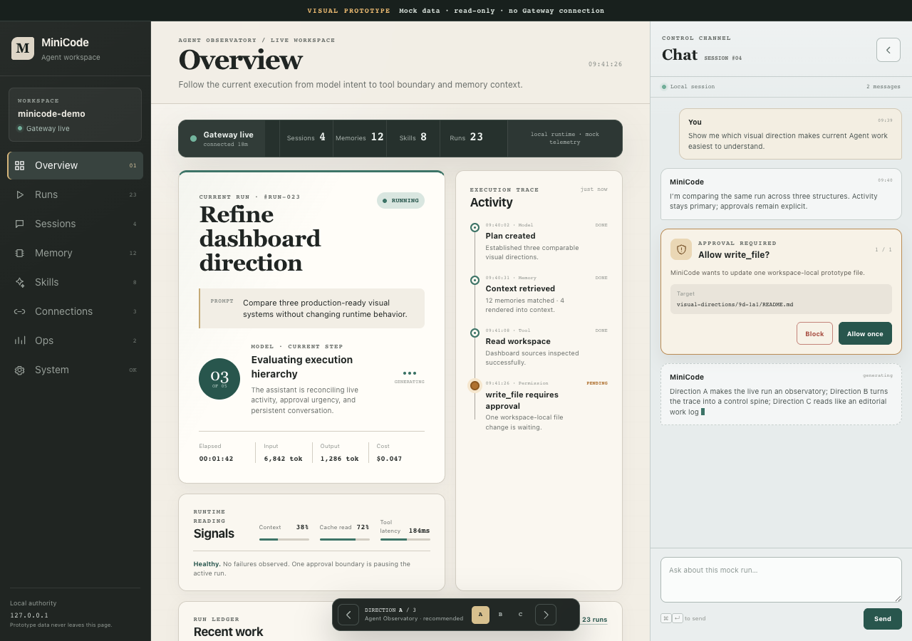
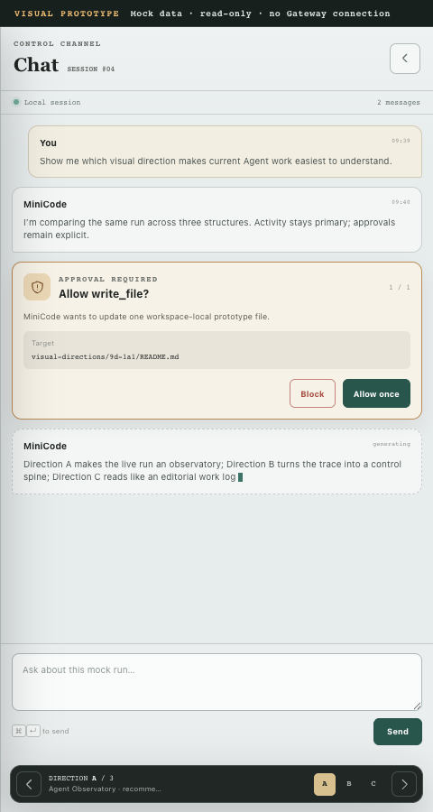
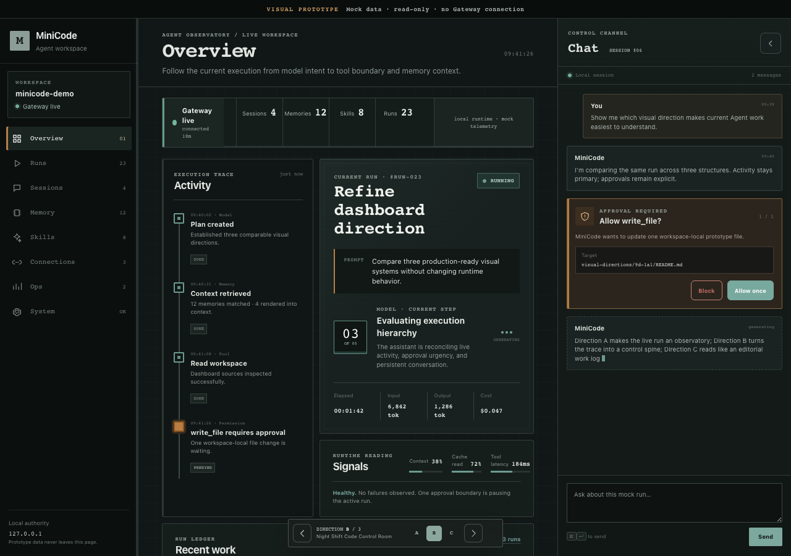
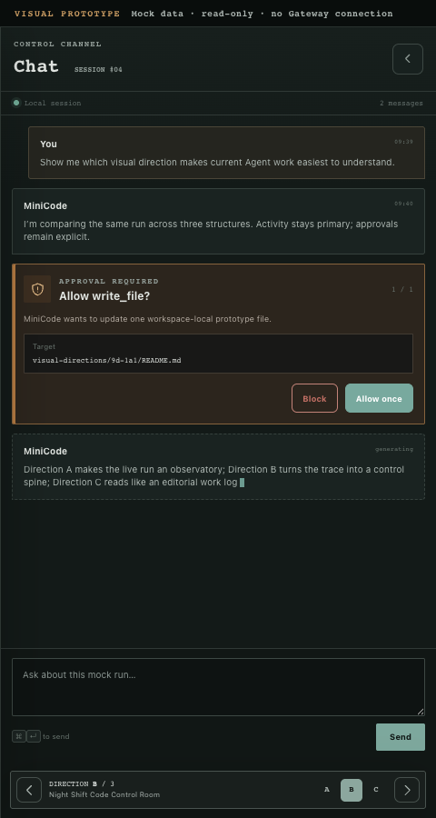
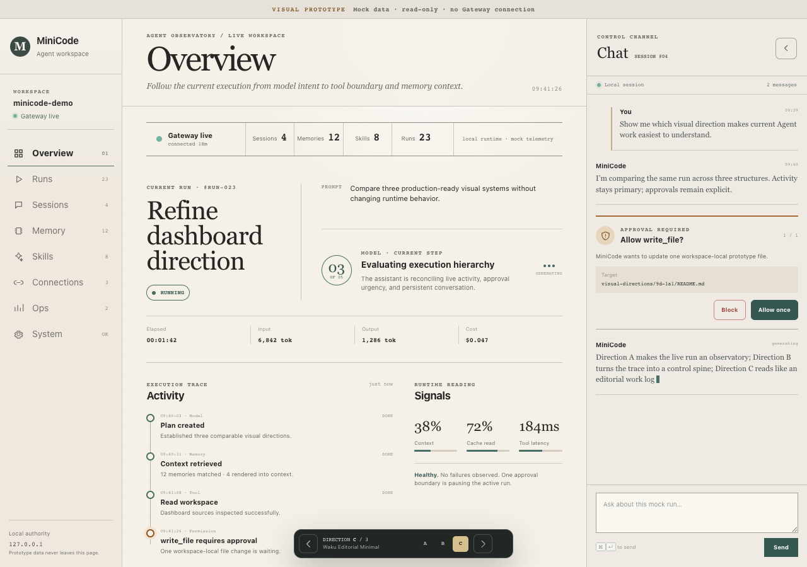
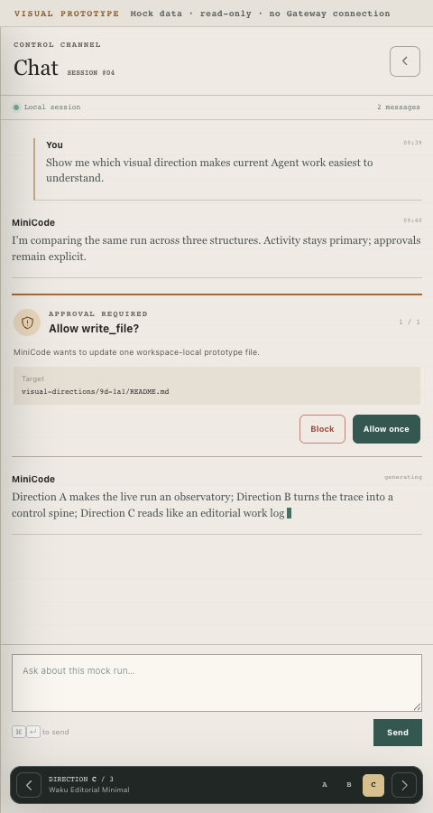

# MiniCode Dashboard Visual Direction Spike — Batch 9D-1A.1

This directory contains three comparable, static visual prototypes for the
same MiniCode Dashboard scenario. They are intentionally mock-only and
read-only: no Gateway API, persistence, EventSource, Store, Agent Loop, Memory
pipeline, permission authority, or production asset is connected.

## Run

From the repository root:

```bash
python -m http.server 8765 \
  --bind 127.0.0.1 \
  --directory dashboard_prototype/visual-directions/9d-1a1
```

Open one of:

- `http://127.0.0.1:8765/?variant=A`
- `http://127.0.0.1:8765/?variant=B`
- `http://127.0.0.1:8765/?variant=C`

The floating switcher changes variants without reloading the page, so a draft
in the Chat composer is retained. `Alt+Left` and `Alt+Right` also cycle the
directions when focus is not inside an editor.

## Shared information contract

All variants use the exact same DOM and mock scenario:

- workspace `minicode-demo`, Gateway live;
- Sessions 4, Memories 12, Skills 8, Runs 23;
- current `#run-023`, running, Model step 3 of 5;
- completed Tool read, retrieved/rendered Memory context;
- one `write_file` approval waiting;
- input/output token and cost observations;
- two Chat messages and an Assistant generating state.

All eight primary navigation items visually switch. The current Run can be
selected, the Dock can collapse/reopen, Allow and Block create local visual
states, Escape closes responsive overlays, and the composer draft survives
those transitions. None of these actions leaves page memory.

## Direction A — Agent Observatory

**Intent.** Make the live Agent execution the dominant reading surface while
retaining Waku's calm three-column shell.

**Memorable feature.** A warm editorial work surface is anchored by a dark
graphite rail, cool conversation Dock, horizontal instrumentation band, and a
large current-run observation card paired with a chronological activity trace.

**Advantages.**

- The current run is the first visual destination without hiding inventory.
- Tool, Memory, Model, and Permission events form one execution narrative.
- Warm/cool surface separation makes observation and conversation distinct.
- A pending approval interrupts clearly without turning the entire UI into an
  alert state.
- It is closest to the current Waku shell, limiting visual migration cost.

**Disadvantages and risks.**

- The main Run card still uses a contained surface and could become dense when
  real trace detail grows.
- The asymmetric desktop grid needs careful treatment for future diff,
  sub-agent, and streaming tool payloads.
- Warm paper texture and serif display type require contrast regression checks
  when real status colors are introduced.





## Direction B — Night Shift Code Control Room

**Intent.** Optimize for prolonged technical monitoring and turn the execution
trace into a persistent control spine.

**Memorable feature.** A restrained dark room places a vertical, square-node
activity spine to the left of the current-run console. Muted teal and amber are
operational accents; there is no neon, purple, glow, or game-like treatment.

**Advantages.**

- The vertical trace supports rapid temporal scanning and interruption triage.
- Dark, low-glare surfaces are comfortable in dim operational environments.
- Square geometry and compact monospace labels communicate runtime precision.
- The approval boundary reads as part of execution control, not a generic card.

**Disadvantages and risks.**

- Lower lightness contrast between secondary surfaces makes long daytime use
  and projector use less forgiving.
- Monospace density can become fatiguing if real payloads are not carefully
  typographically separated.
- It is the largest visual departure from the current shell and therefore the
  highest CSS and regression-review cost.





## Direction C — Waku Editorial Minimal

**Intent.** Treat Agent execution as a legible work log rather than a collection
of application cards.

**Memorable feature.** A light editorial report uses rules, typography, white
space, and a broad headline run statement. Most containers disappear; Activity
and Signals read as columns in an evolving local notebook.

**Advantages.**

- It has the clearest typographic identity and the fewest competing containers.
- Long-form Chat and execution summaries are especially comfortable to read.
- The desktop surface exposes relationships through placement rather than
  repeated badges and card chrome.
- Its mobile Dock feels like one continuous, focused work transcript.

**Disadvantages and risks.**

- Sparse rules provide less enclosure for highly interactive future controls.
- Urgent operational states require disciplined typography and color because
  there are fewer container boundaries.
- A real dense diff or trace may erode the intended white-space rhythm.





## Comparison

| Dimension | A · Agent Observatory | B · Night Shift Control Room | C · Editorial Minimal |
| --- | --- | --- | --- |
| First-look appeal | Strong, balanced contrast; reads immediately as an Agent workbench | Strongest technical mood; intentionally specialized | Strongest editorial personality; calm and distinctive |
| MiniCode identity | High: Waku warmth plus explicit execution observatory | High for runtime/operator use; less recognizably Waku | High for local, thoughtful work; least conventional dashboard |
| Information scanning | Excellent current-run/activity pairing | Excellent temporal trace scanning | Excellent summary reading; slower for many simultaneous alerts |
| Long-session comfort | High in normal office light | High in dim environments; mixed in bright rooms | High for reading; dense operations may need more structure |
| Chat / observation balance | Best overall separation without isolation | Observation has priority; Chat feels secondary | Most conversational/editorial; live telemetry feels quieter |
| Permission / diff readability | Clear interrupt with calm surrounding context | Most operationally explicit | Highly legible, but relies more on rule/color emphasis |
| Desktop layout | Mature three-column composition | Dense, technical two-part execution console | Spacious report composition with minimal chrome |
| Narrow layout | Clear full-width Dock and compact approval card | Efficient but visually dense | Most readable transcript; longest vertical rhythm |
| Implementation risk | Medium-low; shell concepts align with production | High; broad color, geometry, and component-state rewrite | Medium; fewer boxes but substantial typography/layout changes |
| Future extensibility | High for richer Run, Memory, Tool and approval observability | High for trace-heavy operations and sub-agent activity | Medium-high for logs and review; weaker for dense control panels |

## Accessibility

All directions use semantic headings, navigation state, listbox selection,
labelled controls, `aria-live` feedback, visible keyboard focus, and a
`prefers-reduced-motion` fallback. The browser check confirmed focus enters a
visible control and motion duration collapses under reduced-motion preference.

Remaining production-review risks differ:

- A: recheck muted microcopy and warm surface contrast with real dynamic state.
- B: perform a complete dark-theme WCAG contrast audit, especially secondary
  labels and disabled states.
- C: ensure status meaning never depends on typography or color alone when more
  runtime states arrive.

## Responsive behavior

- At 1280 px, all three directions use a native three-column Shell.
- At 1024 px, the rail remains available and the Dock becomes a right overlay.
- At 700 px, both navigation and Dock are reopenable overlays.
- At 480 px, the Dock occupies the full viewport width; its composer and variant
  switcher remain usable and Escape closes it.

The browser check also substituted deliberately long Run, Session, and Skill
identifiers at responsive widths; document width remained equal to viewport
width.

## Estimated production change

| Direction | Expected change size | Existing business-hook risk |
| --- | --- | --- |
| A | Medium CSS/markup composition change; reuse current shell, route, Dock, status, and action hooks | Low-medium if DOM hooks are preserved and visual wrappers stay passive |
| B | Large theme, geometry, ordering, and responsive change | Medium-high; trace ordering and dark-state variants need broad UI regression coverage |
| C | Medium-large typography, spacing, and container reduction | Medium; fewer wrappers simplify some code but interactive state affordances need revalidation |

The estimates are visual-integration estimates only. This Spike did not inspect
or modify production behavior contracts beyond the frozen visual audit.

## Recommendation

Direction **A · Agent Observatory** is the recommended starting point for user
selection because the evidence shows the strongest balance of current-run
priority, chronological activity, Chat continuity, approval visibility,
desktop density, narrow-screen usability, and lower migration risk. Its
1280 px composition is visibly different from a generic metric dashboard while
remaining compatible with the existing three-column Waku shell.

That does not make A the only valid answer. B is stronger if MiniCode's primary
future is sustained runtime operations and trace analysis. C is stronger if
review, conversation, and a durable editorial work log should define the
product identity. A credible mixed direction would combine A's shell and
current-run hierarchy with B's execution spine or C's low-chrome transcript.

## Browser evidence

- Real local HTTP responses: HTML 200 `text/html`, CSS 200 `text/css`, JS 200
  `text/javascript`.
- 1280×900 document widths: A 1280, B 1280, C 1280; no horizontal overflow.
- Desktop client columns (rail / main / Dock, excluding scrollbars):
  A 212 / 700 / 367 px; B 224 / 678 / 377 px; C 194 / 736 / 349 px.
- A responsive widths: 1024×768 → document 1024, Dock 368 overlay; 700×900 →
  document 700, Dock 420 overlay, navigation 290 overlay; 480×900 → document
  480, Dock 480 full-width.
- Allow and Block stayed visible at every responsive viewport; the composer
  bottom equalled the viewport bottom and was not clipped.
- Browser console errors/warnings: 0. Page errors: 0. Failed requests: 0.
  External requests: 0.

## Decision required

No direction has been selected or merged into production. Choose:

- **A** — Agent Observatory;
- **B** — Night Shift Code Control Room;
- **C** — Waku Editorial Minimal; or
- a specific mix, such as “A shell + B activity spine” or “A hierarchy + C
  Chat/editorial treatment.”
