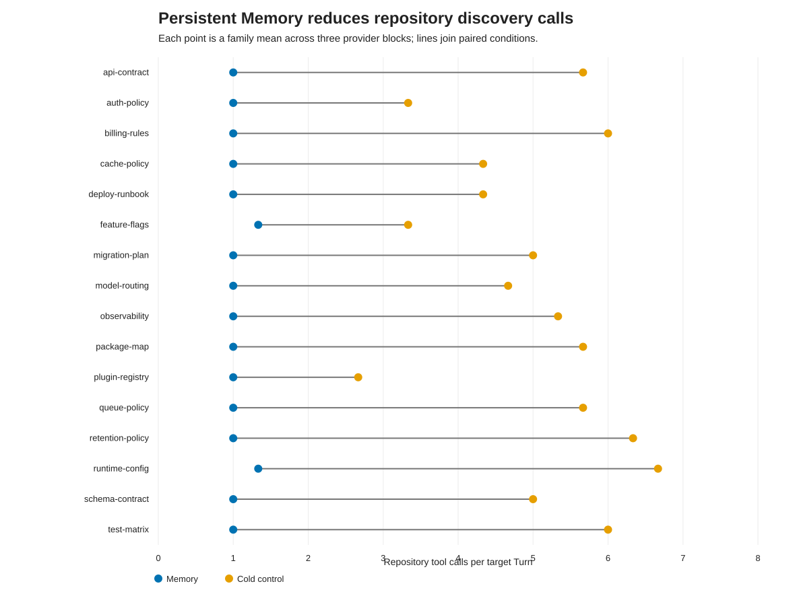
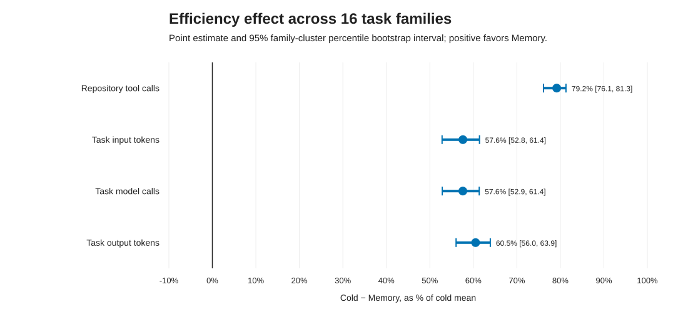
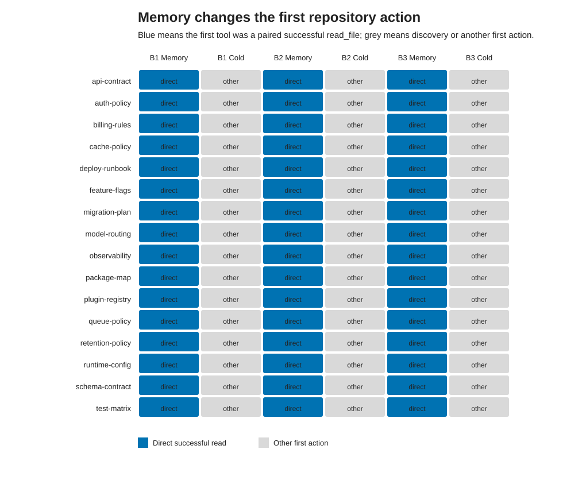

# 1. 执行摘要

这轮实验把此前 4 个场景、12 对观察扩展为 **16 个任务家族、3 个重复块、48 对 warm/cold 对照、96 个目标 Turn**。其中 8 个家族通过真实的“调用失败—定位正确目标—成功恢复—生成教训”链路创建记忆，另外 8 个家族使用预置且已批准的恢复记忆；学习链另外包含 24 个创建 Turn，因此全实验实际执行 **120 个 live Turn**。

核心结论是：在本实验覆盖的“同一项目中新对话重新定位已知资源”任务上，持久化记忆产生了稳定、显著且具有实际量级的效率收益，同时没有观察到成功率下降。

- Memory：48/48 目标 Turn 成功；冷启动：47/48 成功。
- 平均仓库工具调用从 5.00 次降至 1.04 次，减少 **79.2%**，家族聚类 bootstrap 95% CI 为 **76.1%–81.3%**。
- 平均任务输入 token 从 32,078 降至 13,602，减少 **57.6%**，95% CI 为 **52.8%–61.4%**。
- 工具调用和输入 token 在 16/16 个独立任务家族上均朝 Memory 有利的方向变化；两项精确 Wilcoxon 检验经 Holm 校正后均为 `p=0.000061`。
- 48/48 个 Memory Turn 的第一个仓库动作都是配对成功的 `read_file`，冷启动为 0/48，说明收益机制确实是“先验证记忆目标，避免广泛探索”。

因此，这组结果已经足以写成一份严谨的内部实验或工程技术报告。它支持的是**相关且已批准的路径恢复记忆**，不能外推成“所有 coding 任务均提升 57%–79%”。

# 2. 实验身份与决策问题

研究问题：在同一个合成项目中开启未见过的新对话时，相比没有 Memory 的相同项目和相同提示，注入一条相关、已批准的恢复教训，是否能在保持外部 oracle 成功的前提下降低仓库发现成本？

- 冻结套件：`minicode-persistent-memory-large-live-2026-08-21-v3`
- 主要推断单位：任务家族，`n=16`
- 嵌套重复：每个家族 3 个 provider block
- 配对比较：48 对
- 目标 Turn：96 个
- 教训创建 Turn：24 个
- live Turn 总数：120 个
- 分层：应用安全、运维、数据治理、开发者平台，各 4 个家族
- 教训来源：8 个 learned 家族、8 个 seeded 家族

三个重复块用于观察模型随机性，不能当成 48 个独立样本。所有显著性检验和 bootstrap 均以 16 个家族为单位。

# 3. 实验设置与证据规则

每一对 warm/cold 目标任务使用相同的合成文件、相同 marker 和相同用户提示，分别在隔离工作区执行。每个 block 内的家族顺序固定随机化；每块恰有 8 个 warm-first 和 8 个 cold-first 配对，以降低时间漂移和执行顺序偏差。

目标成功必须同时满足：Run 完成、canonical outcome 为 success、存在配对成功的 `read_file`、最终响应含目标文件中的精确 marker、没有源文件编辑。Memory 条件还必须观察到真实的 `memory.rendered(injected=true)`。

learned 条件还要求首个 Turn 出现配对失败的 `read_file`、随后配对成功的恢复读取、生成持久化教训，并在下一 Turn 实际检索和注入。24/24 条学习链均通过这些门。

本轮完整执行消耗 489 次模型调用、3,185,083 个输入 token、37,880 个输出 token；各 case 耗时之和为 754.6 秒。运行后的安全配置摘要显示父代理模型配置为 `deepseek-chat`，但当前 Run Journal 没有冻结 model ID，因此这只能视为环境记录，不能作为与结果哈希同等级的模型来源证据。子代理 Qwen 路由未参与这些单代理读取任务。

# 4. 主要发现

| 指标 | Memory（48 Turn） | Cold（48 Turn） | 变化 |
|---|---:|---:|---:|
| 外部 oracle 成功 | 48/48 | 47/48 | Memory 未观察到成功损失 |
| 工具调用总数 | 50 | 240 | -190（-79.2%） |
| 任务模型调用总数 | 98 | 231 | -133（-57.6%） |
| 任务输入 token | 652,911 | 1,539,738 | -886,827（-57.6%） |
| 任务输出 token | 5,494 | 13,914 | -8,420（-60.5%） |
| 目标 Turn 耗时之和 | 150.6 秒 | 327.7 秒 | -177.2 秒（-54.1%） |
| direct-first | 48/48 | 0/48 | +48 |

三个 block 的平均工具调用节省分别为 4.56、3.63 和 3.69 次；平均输入 token 节省分别为 21,765、16,538 和 17,125。warm-first 与 cold-first 子组的平均工具节省为 4.00 和 3.92 次，方向没有随执行顺序翻转。

learned 与 seeded 两类记忆也均保持同方向：

- learned：工具调用减少 81.2%，输入 token 减少 59.8%；
- seeded：工具调用减少 76.6%，输入 token 减少 55.1%。

这说明结果并非只由预置记忆驱动；真实失败后生成的教训也在新对话中产生了相似收益。

# 5. 统计结果

主要 estimand 为家族级 `cold − Memory`。正值表示 Memory 节省资源。

| 指标 | Cold 家族均值 | Memory 家族均值 | 平均绝对节省 | HL 节省 | 家族聚类 95% CI | 精确 Wilcoxon p | Holm p | Rank-biserial |
|---|---:|---:|---:|---:|---:|---:|---:|---:|
| 工具调用 | 5.00 | 1.04 | 3.96 | 4.00 | [3.38, 4.48] | 0.000031 | 0.000061 | 1.000 |
| 输入 token | 32,077.88 | 13,602.31 | 18,475.56 | 18,096.25 | [15,377.63, 21,412.04] | 0.000031 | 0.000061 | 1.000 |
| 模型调用 | 4.81 | 2.04 | 2.77 | 2.67 | [2.31, 3.21] | 0.000031 | 0.000122 | 1.000 |
| 输出 token | 289.88 | 114.46 | 175.42 | 182.83 | [150.29, 197.42] | 0.000031 | 0.000122 | 1.000 |
| 耗时（ms） | 6,828.10 | 3,137.44 | 3,690.67 | 3,691.17 | [3,064.48, 4,296.98] | 0.000031 | 0.000122 | 1.000 |

工具失败只有一个 cold Turn 出现，Memory 为零；家族级绝对差为 0.021 次，95% CI [0.000, 0.062]，Wilcoxon `p=1.0`。样本过于稀疏，不能用“工具失败降低 100%”作为有效结论。

Memory 成功 48/48 而 cold 为 47/48 是有利的描述性结果，但本实验没有预注册非劣效界，因此不能把它表述为正式的成功率非劣效证明。

# 6. 图表解释

图 1 中每条线代表一个任务家族的三块均值。16 条线全部从右侧 cold 点连向左侧 Memory 点，没有家族方向翻转。这比只报告总均值更重要，因为它说明结果不是由一两个极端任务拉动。

图 2 显示四项主要资源成本的家族聚类 bootstrap 区间均完全位于零右侧。工具调用的降幅最大；模型调用与输入 token 的降幅接近，符合“少走探索步骤，减少后续对话轮次”的机制。

图 3 显示 48 个 Memory 目标 Turn 全部从成功 `read_file` 开始，而 cold 全部先采取其他发现动作。Journal 出于隐私设计不记录工具参数，因此该图能证明动作类型与成功状态，不能单独证明读入的具体路径；具体任务成功仍由 marker、配对工具事件和 oracle 联合约束。

# 7. 失败、异常与局限

唯一目标失败是 `pmem-b3-package-map-cold`。代理先执行目录探索，并行读取两个候选，其中一个读取失败、一个成功；但随后只返回“正在探索”的进度句，没有报告已读到的 `PACKAGE-MAP-357`，因此 `marker-found` oracle 失败。该运行的内部 `task.outcome` 自报 success，进一步说明实验必须以外部 oracle 为准。此样本保留在首轮意向分析中，没有补跑或替换。

V1 和 V2 smoke 曾因“失败路径与恢复路径不能被严格证明是同一工具目标”而不生成教训。这是实验设计问题，不是产品失败；两个旧 manifest 与失败证据均保留，V3 只修正了路径恢复证据的可判定性，且在完整执行前冻结。

主要外推限制如下：

- 所有任务都是合成、只读、路径恢复并回报 marker，不涵盖代码修改、调试、重构、架构设计和多代理长任务。
- 16 个家族虽然横跨四个语义分层，但共享同一种 `read_file` 高层机制，统计独立性可能仍被高估。
- 本轮保证相关 Memory 存在；没有评测大记忆库中的召回、hard negative、错误注入或记忆冲突。
- 48/48 direct-first 证明提示与记忆能强烈影响工具选择，但工具参数在日志中被隐去。
- 当前结果没有冻结模型 ID、采样参数和远端模型版本；未来复现实验应把无凭据 runtime manifest 写入结果。
- bootstrap 区间描述当前 16 个家族的变化，不覆盖未来模型升级、provider 漂移或真实仓库分布变化。

# 8. 信念更新

实验前，对“持久化教训能够减少同类任务的重复探索”只有中等信心，因为旧实验只有 4 个家族、重复较少且 warm 行为有随机不遵从。

实验后，可将以下判断提升为高信心：**当相关、已批准的路径恢复教训被正确检索并注入时，MiniCode 能在同项目的新对话中稳定直接验证已知目标，并显著减少仓库探索、模型轮次和 token。** 证据包括 16/16 家族一致方向、48/48 注入、48/48 direct-first 和严格的家族级不确定性分析。

以下判断仍维持未知或低信心：Memory 是否能提高一般 coding 成功率；语义检索面对大规模噪声记忆时是否仍准确；错误或过期教训是否会造成净伤害；写任务和长上下文压缩与 Memory 联合作用时是否仍保持当前收益。

# 9. 决策与下一步

当前可以在文档中使用如下有边界的结论：

> 在 16 个合成路径恢复任务家族、3 个重复块和 48 对 warm/cold 目标对照中，相关且已批准的持久化记忆将平均仓库工具调用减少 79.2%（95% CI 76.1%–81.3%），将任务输入 token 减少 57.6%（95% CI 52.8%–61.4%）；Memory 目标成功 48/48，冷启动成功 47/48。

不应写成“MiniCode 在所有 coding 任务上节省 79%”或“持久化记忆已证明提高通用成功率”。

下一轮优先级：

1. 建立 50–100 个异质真实 coding 任务，覆盖读、写、测试、调试、重构和多代理任务。
2. 加入大记忆库、hard negative、冲突与过期教训条件，联合测量检索 precision、净任务收益和错误注入伤害。
3. 预注册成功率非劣效界并扩大独立项目数量，而不是继续增加同家族重复。
4. 在 live result 中冻结无凭据 runtime manifest，包括模型 ID、provider、采样参数、代码 revision 和配置摘要。
5. 跟踪一条教训的累计复用次数。24 个学习 Turn 的保守估计显示，整次恢复任务按纯成本计算约需 1.93 次同类复用摊平任务输入 token，含反思约 2.03 次；真实恢复任务本身也有工作价值，因此这是偏保守估计。

# 10. 产物索引

- 冻结 manifest：`artifacts/persistent-memory-large-study-v3/manifest.json`
  - SHA-256: `923272933307127ab0a99e45e1e8449f10ee8a121810baf05e71196d195f6e0d`
- 首轮完整结果：`artifacts/persistent-memory-large-study-v3/full-results-initial.json`
  - SHA-256: `6cb06e4ce0aca747f837a678b8f678ceb7b5249ba6ae4e078664c55adbaed592`
- 严格分析报告：`artifacts/persistent-memory-large-study-v3/analysis-output/analysis-report.md`
- 统计附录：`artifacts/persistent-memory-large-study-v3/analysis-output/stats-appendix.md`
- 图表目录：`artifacts/persistent-memory-large-study-v3/analysis-output/figure-catalog.md`
- 目标级数据：`artifacts/persistent-memory-large-study-v3/analysis-output/turn-level.csv`
- 学习 Turn 数据：`artifacts/persistent-memory-large-study-v3/analysis-output/learning-turn-level.csv`
- 配对级数据：`artifacts/persistent-memory-large-study-v3/analysis-output/pair-level.csv`
- 家族级数据：`artifacts/persistent-memory-large-study-v3/analysis-output/family-summary.csv`
- 统计机器结果：`artifacts/persistent-memory-large-study-v3/analysis-output/statistics.json`
- 产物哈希索引：`artifacts/persistent-memory-large-study-v3/analysis-output/reproducibility-index.json`
- 构建脚本：`scripts/build_persistent_memory_large_study_manifest.py`
- 分析脚本：`scripts/analyze_persistent_memory_large_study.py`
- live runner：`scripts/run_north_star_live.py`

本报告写入普通仓库文档目录；项目未声明 Obsidian 写回目标，因此没有执行外部知识库写回。
