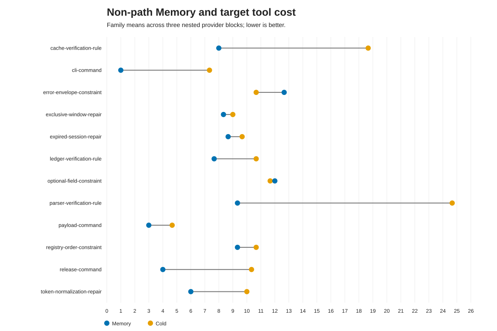
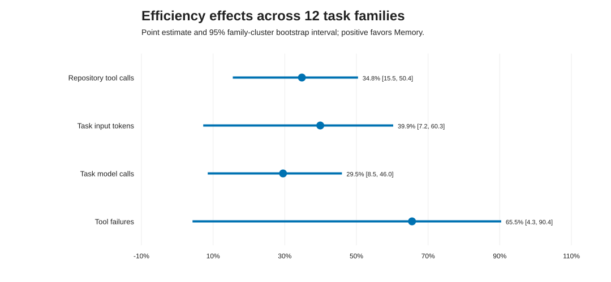
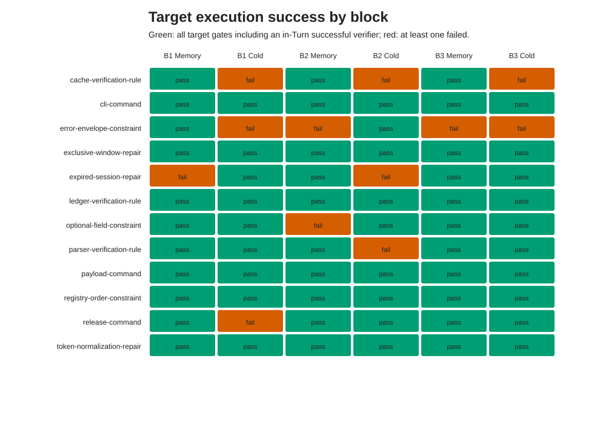

# Non-Path Persistent Memory / Round 1 / Robustness Check / 2026-08-22

## 1. Executive Summary

这轮实验回答的是此前仍然开放的问题：MiniCode 的持久化记忆是否只会记住“文件在哪里”，还是也能复用命令恢复、代码修复、项目约束和验证规则。

结论是：**非路径记忆已经产生了可测的正向效果，但不同类别差异很大，不能概括为所有教训都同样有效。** 在 12 个独立合成任务族、3 个随机 provider 区块、36 组配对比较中，Memory 条件严格成功 32/36（88.9%），冷启动为 28/36（77.8%）。若只放宽一个过度具体的精确源码字符串 oracle，仍要求独立测试、Turn 内验证命令和 marker 全通过，则为 33/36（91.7%）对 29/36（80.6%）。

Memory 的平均目标 Turn 工具调用从 11.50 降至 7.50，下降 34.8%（family-cluster 95% CI 15.5%–50.4%，Holm 校正 p=0.0186）。输入 token 从 85,914 降至 51,632，下降 39.9%（95% CI 7.2%–60.3%），但精确 Wilcoxon 的 Holm 校正 p=0.0522，属于边界证据，不应写成确定显著。

决策上，可以把“持久化记忆只在路径恢复上有效”的旧判断升级为“在命令恢复与验证规则上已有较强的类别内证据，在代码修复上有温和效率收益；项目约束仍不稳定”。当前不应把记忆系统整体宣称为普适成熟。

## 2. Experiment Identity and Decision Context

- 实验线：`non-path-persistent-memory`
- 轮次：Round 1
- 目的：验证持久化教训能否跨新对话改变非路径工程动作，并测量成功率、工具成本和 token 成本。
- 先验边界：2026-08-21 的大实验只证明了路径恢复，16 个任务族中 Memory 将工具调用降低 79.2%，但没有覆盖代码修复、命令、项目约束或验证策略。
- 本轮决策问题：是否已有足够证据把非路径教训纳入 MiniCode 的稳定能力描述；如果没有，最薄弱的类别和接口在哪里。

本仓库未绑定 Obsidian 项目知识库，因此本报告作为本地 Markdown 产物保存，没有执行 Obsidian write-back。

## 3. Setup and Evaluation Protocol

实验使用 12 个互相隔离的纯合成任务族，每类 3 个：

| 教训类别 | 学到的内容 | 代表例子 |
|---|---|---|
| 命令恢复 | 失败命令与通过验证的替代命令 | 缺失 unittest 模块 → 正确测试模块 |
| 代码修复 | 失败测试、源码变更与同一测试通过 | 过期会话必须先于 known 判断 |
| 项目约束 | 来自 `project-policy.md` 的稳定规范 | 新公开响应字段必须 optional |
| 验证规则 | 改动特定模块后必须执行的验证命令 | parser 改动后运行指定 unittest 类 |

8 个 learned 任务族先执行一次教训创建 Turn，4 个 seeded 任务族直接注入预构造且已批准的教训。每个任务族在 3 个随机区块中各运行一次 Memory 和一次冷启动目标 Turn，共 36 对、72 个目标 Turn；加上 24 个教训创建 Turn，总计 96 个真实 provider Turn。

Memory 与冷启动的目标工作区状态完全匹配。正式统计单位是任务族（n=12），三个区块只作为嵌套重复，不能伪装成 36 个独立样本。主指标预注册为严格外部成功、目标 Turn 工具调用和 provider 输入 token；模型调用、输出 token、工具失败和时长为次要指标。

严格成功要求：目标文件/命令 oracle、独立 verifier、响应 marker、目标 Turn 内至少一次成功的 `run_command` 和 canonical task outcome 全部成立。远端只接收合成模块、命令、错误和 marker，不包含用户真实项目内容。四类开发 smoke 与正式 72 个 case 分离，不进入统计。

## 4. Main Findings

### 4.1 总体结果

| 指标 | Memory | 冷启动 | 差异 |
|---|---:|---:|---:|
| 严格成功 | 32/36（88.9%） | 28/36（77.8%） | +11.1 个百分点 |
| 语义敏感性成功 | 33/36（91.7%） | 29/36（80.6%） | +11.1 个百分点 |
| 平均工具调用 | 7.50 | 11.50 | -34.8% |
| 平均输入 token | 51,632 | 85,914 | -39.9% |
| 平均模型调用 | 7.03 | 9.97 | -29.5% |
| 平均工具失败 | 0.83 | 2.42 | -65.5% |
| 平均时长 | 11.79 秒 | 20.50 秒 | -42.5% |

36/36 个 Memory 目标 Turn 都注入了至少一条记忆，冷启动注入为 0/36。24/24 个 learned 创建 Turn 都生成了持久化条目，并满足严格创建证据门。这证明观察到的对比不是“配置了 Memory 但实际没命中”。

### 4.2 类别差异

| 类别 | Memory 成功 | 冷启动成功 | Memory / 冷工具调用 | 解释 |
|---|---:|---:|---:|---|
| 命令恢复 | 9/9 | 8/9 | 2.67 / 7.44 | 最稳定；正确命令能直接改变下一轮动作 |
| 验证规则 | 9/9 | 5/9 | 8.33 / 18.00 | 最大绝对收益；冷启动容易猜目录、包装 shell 并振荡 |
| 代码修复 | 8/9 | 8/9 | 7.67 / 9.56 | 成功率持平，效率温和改善；各有一例被精确源码字符串误判 |
| 项目约束 | 6/9 | 7/9 | 11.33 / 11.00 | 没有收益，且略差；“约束是什么”与“如何验证”没有形成完整动作包 |

因此，记忆优势主要来自可执行性高的教训：明确的正确命令，或明确的“改完后运行什么”。抽象约束即使被准确注入，也未必能减少工具探索或避免命令形态错误。

## 5. Statistical Validation

每个任务族先对三个区块取条件均值，再计算 cold − Memory 的配对差。精确双侧 Wilcoxon signed-rank 检验枚举全部符号分配；95% CI 使用 20,000 次、seed `20260822` 的 family-cluster percentile bootstrap。两个主指标单独做 Holm 校正，四个次要指标形成另一个探索性 Holm family。

| 指标 | 相对下降 | 95% CI | Wilcoxon p | Holm p | 家族方向（正/负） |
|---|---:|---:|---:|---:|---:|
| 工具调用 | 34.8% | 15.5%–50.4% | 0.0093 | 0.0186 | 10/2 |
| 输入 token | 39.9% | 7.2%–60.3% | 0.0522 | 0.0522 | 8/4 |
| 模型调用 | 29.5% | 8.5%–46.0% | 0.0400 | 0.1201 | 8/4 |
| 输出 token | 45.4% | 5.7%–66.8% | 0.1294 | 0.2588 | 9/3 |
| 工具失败 | 65.5% | 4.3%–90.4% | 0.1504 | 0.2588 | 9/3 |
| 时长 | 42.5% | 13.7%–61.1% | 0.0161 | 0.0645 | 10/2 |

最稳健的推断是工具调用减少。输入 token 的 bootstrap CI 不跨 0，但 exact Wilcoxon p=0.0522；两种方法回答的分布问题不同，且 n=12 较小，所以应表述为“方向一致、幅度可观、精确检验处于边界”，而不是选择性引用一个有利统计量。

教训创建 Turn 平均使用 41,728 个 task input token。仅在 learned 任务族内，以目标复用的平均 token 节省估计，把整个有用的创建 Turn 保守视作 Memory 额外成本，描述性 break-even 约为 1.10 次相似复用。这个数字不是因果端点，因为创建 Turn 本身也完成了实际修复工作。

## 6. Figure-by-Figure Interpretation

### Figure 1 — 每个任务族的工具调用



这张图保留了任务族级配对关系。多数连线从冷启动的橙点指向更低的 Memory 蓝点，支持“收益不是只由一个异常样本产生”。需要注意两个项目约束家族及部分代码修复家族没有改善，说明类别异质性是真实存在的。决策含义是继续优化具体、可验证教训，而不是简单提高所有 Memory 的检索权重。

### Figure 2 — 效率效应与不确定性



四个展示指标的点估计都偏向 Memory，family-cluster 区间也均在正侧。工具失败的百分比区间很宽，因为少数振荡 Turn 占据大量失败，分母不稳定；应结合绝对值 2.42 对 0.83 阅读。决策含义是工具调用下降可作为当前最可信的工程收益，token 和失败率仍需要更多异质任务复现。

### Figure 3 — 每个正式样本的严格成功



热图没有隐藏失败：Memory 仍有 4 个红格，主要集中于项目约束和一例代码修复；冷启动有 8 个红格，验证规则最集中。它支持“总体正向但并非普适”的判断，也显示 provider 随机性——同一任务族在不同区块可能表现不同。决策含义是不能只用一次 demo 宣称能力成立，至少保留多区块重复和失败分类。

## 7. Failure Cases / Negative Results / Limitations

1. **项目约束是明确负结果。** Memory 6/9，冷启动 7/9；工具与 token 均没有改善。当前条目准确告诉模型“字段必须 optional”，但没有总能告诉它怎样以权限允许的命令完成验证。
2. **两个严格失败来自过度具体的 oracle。** `expired-session` 的 Memory 与冷启动各一例都通过独立 unittest，并在 Turn 内成功验证，只因用了语义等价代码而未命中预设字符串。主结果不改写，另报 33/36 对 29/36 的敏感性结果。
3. **命令包装错误频繁出现。** 模型常把允许的 `python -m unittest ...` 包进 `bash -lc`、管道、动态 `python -c`，或设置到 case 根而非 `workspace` 的 cwd。权限层拒绝是正确安全行为，但模型随后多次重复同类失败。
4. **停止条件仍然偏弱。** 最严重的冷启动 parser 样本达到 50 次模型调用、53 次工具调用、31 次工具失败、773,101 输入 token 和 151.8 秒，期间还尝试写未授权的 `pytest.ini`/`pyproject.toml`；安全层全部拦截，但恢复策略明显不合格。
5. **任务仍是合成 unittest 世界。** 12 个家族覆盖四类语义，但共享 Python、小文件和聚焦测试结构，不能外推到多语言构建、网络工具、数据库迁移或长周期架构任务。
6. **样本量与 provider 漂移。** n=12 适合发现大效应，不足以稳定估计小效应；实验只代表当前模型与 2026-08-22 的 provider 行为。
7. **Memory 不是唯一变量的所有现实形态。** 本实验严格匹配目标文件状态，但 Memory 本身就是额外提示信息；它证明系统级可用性，不分解检索、渲染与模型遵循各自的独立贡献。

## 8. What Changed Our Belief

- **得到加强：** 持久化教训可以跨对话复用非路径知识。24/24 条 learned 教训写入，36/36 个 Memory 目标命中，且在命令恢复、验证规则上同时改善成功与成本。
- **得到加强：** 高价值条目应接近“适用条件 + 已验证动作 + 不要重用的失败动作”，而不是抽象摘要。命令恢复的 9/9 与 2.67 次平均工具调用是最清晰例子。
- **被削弱：** “只要把项目规范存进 Memory，下一次就会更稳定”不成立。项目约束类别的结果不优于冷启动。
- **仍未解决：** 这种收益能否迁移到真实大仓库、非 unittest 工具和跨模型版本；Memory 是否能在长上下文压缩后保持同样遵循度，本轮没有联合施压。

当前能力描述应更新为：**MiniCode 的持久化记忆已在路径恢复、命令恢复和验证规则上有重复实验支持；代码修复有初步效率证据；抽象项目约束仍处于实验状态。**

## 9. Next Actions

1. 修复重复权限拒绝后的恢复策略：对相同拒绝签名做去重与短路，并明确提示使用直接 `run_command(command="python", args=[...], cwd=workspace)`，禁止再包 shell。
2. 把“项目约束 + 权限兼容 verifier”合并为复合教训，再针对 project-constraint 原 3 个家族做预注册复验；在新数据前，不调高该类别的路由权重。
3. 将代码修复 oracle 改成行为/性质验证，精确源码字符串只作诊断，不再作为主成功门；保留反例测试防止语义错误实现钻空子。
4. 增加 20–30 个非 unittest、跨语言或多文件的真实仓库风格任务，并在不同 provider 日期/模型重复；继续以任务族为统计单位。
5. 增加“Memory 注入 + 至少一次强制上下文压缩”的联合实验，验证教训在长任务中是否仍能影响后半程动作。
6. 在上述第 2、4、5 项通过前，不把整个 coding agent 标记为 A+；可以把持久化记忆中的可执行恢复子能力标记为 A- 候选。

## 10. Artifact and Reproducibility Index

| 产物 | 路径 / SHA-256 |
|---|---|
| V1 失败设计清单 | `artifacts/non-path-memory-study-v1/manifest.json` / `63738ee553772286b634e929fa3bb9ca9a61c1b6d17bd3cff04b3308cb165757` |
| 正式 V2 清单 | `artifacts/non-path-memory-study-v2/manifest.json` / `26c1c63ccdf737860bbc3a287b7848827f26715207ba2e4ff1e1fdb06287b85f` |
| 四类开发 smoke | `artifacts/non-path-memory-study-v2/smoke-four-categories-first-attempt.json` |
| 正式首轮结果 | `artifacts/non-path-memory-study-v2/full-first-attempt.json` / `56b7c9375ec26a693a3fcc37298fe4c6a75fbd7014d3deaa9ab6f1d218a2ca44` |
| 严格分析目录 | `artifacts/non-path-memory-study-v2/analysis-output/` |
| 分析脚本 | `scripts/analyze_non_path_memory_study.py` |
| 清单构建器 | `scripts/build_non_path_memory_study_manifest.py` |
| 离线合同测试 | `tests/test_non_path_memory_study.py` |
| 分析复现索引 | `artifacts/non-path-memory-study-v2/analysis-output/reproducibility-index.json` |

复现命令：

```bash
python3 scripts/analyze_non_path_memory_study.py \
  --manifest artifacts/non-path-memory-study-v2/manifest.json \
  --result artifacts/non-path-memory-study-v2/full-first-attempt.json \
  --output-dir artifacts/non-path-memory-study-v2/analysis-output
```

分析 bundle 包含 `turn-level.csv`、`learning-turn-level.csv`、`pair-level.csv`、`family-summary.csv`、`statistics.json`、`analysis-report.md`、`stats-appendix.md`、`figure-catalog.md` 和 3 张可复现 SVG。原始 prompt/response 只保存在本地 evidence sidecar，公开结果文件不包含它们。
