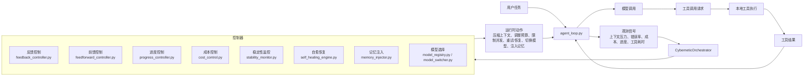
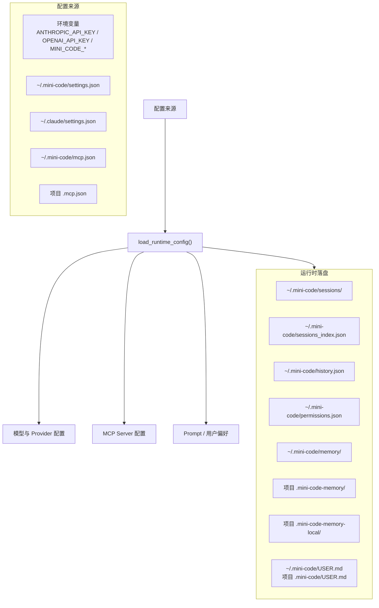

# MiniCode Python 架构图

这份图描述当前根目录有效包 `minicode/` 的主要运行链路。`py-src/` 是迁移/镜像目录，`ts-src/` 是 TypeScript 参考实现，不作为本图的主路径。

## 总览

```mermaid
flowchart TB
    User["开发者 / 自动化系统"] --> Entrypoints

    subgraph Entrypoints["入口层"]
        CLI["minicode-py<br/>minicode.main"]
        TUI["交互式 TTY/TUI<br/>tty_app.py + tui/"]
        Headless["一次性执行<br/>minicode-headless"]
        Gateway["HTTP 网关<br/>minicode-gateway"]
        Cron["定时任务<br/>minicode-cron"]
    end

    CLI --> Runtime
    TUI --> Runtime
    Headless --> Runtime
    Gateway --> Runtime
    Cron --> Runtime

    subgraph Runtime["Agent 运行时"]
        Prompt["System Prompt 构建<br/>prompt.py / prompt_pipeline.py"]
        Loop["主 Agent Loop<br/>agent_loop.py"]
        Context["上下文管理与压缩<br/>context_manager.py / context_compactor.py"]
        WorkChain["任务解析与执行链<br/>intent_parser.py / task_object.py / pipeline_engine.py"]
        Orchestrator["控制论编排器<br/>cybernetic_orchestrator.py"]
    end

    Runtime --> Models
    Runtime --> Tools
    Runtime --> StateLayer

    Prompt --> Loop
    Context --> Loop
    WorkChain --> Loop
    Orchestrator --> Loop

    subgraph Models["模型层"]
        Registry["模型注册与路由<br/>model_registry.py"]
        Anthropic["Anthropic Adapter<br/>anthropic_adapter.py"]
        OpenAI["OpenAI-Compatible Adapter<br/>openai_adapter.py"]
        Mock["Mock Model<br/>mock_model.py"]
    end

    Loop --> Registry
    Registry --> Anthropic
    Registry --> OpenAI
    Registry --> Mock
    Anthropic --> LLM["外部 LLM API"]
    OpenAI --> LLM

    subgraph Tools["工具层"]
        ToolRegistry["Tool Registry<br/>tooling.py"]
        FileTools["文件工具<br/>read/write/edit/patch/list/grep"]
        ExecTools["执行与验证<br/>run_command / test_runner"]
        CodeTools["代码理解<br/>code_nav / code_review / diff_viewer"]
        GitTools["Git 工具<br/>git.py"]
        WebTools["Web 工具<br/>web_fetch / web_search"]
        TaskTool["子 Agent<br/>task.py"]
        MCP["MCP 工具桥接<br/>mcp.py"]
        Skills["Skills 加载<br/>skills.py / load_skill.py"]
    end

    Loop --> ToolRegistry
    ToolRegistry --> FileTools
    ToolRegistry --> ExecTools
    ToolRegistry --> CodeTools
    ToolRegistry --> GitTools
    ToolRegistry --> WebTools
    ToolRegistry --> TaskTool
    ToolRegistry --> MCP
    ToolRegistry --> Skills

    subgraph StateLayer["状态、权限与记忆"]
        Permissions["权限控制<br/>permissions.py / auto_mode.py"]
        Session["会话持久化<br/>session.py"]
        Memory["长期记忆<br/>memory.py / memory_pipeline.py"]
        Profile["用户画像<br/>user_profile.py"]
        Store["运行时状态 Store<br/>state.py"]
        History["输入历史<br/>history.py"]
    end

    ToolRegistry --> Permissions
    Prompt --> Memory
    Prompt --> Profile
    Loop --> Session
    Loop --> Store
    CLI --> History
```

## 控制闭环

```mermaid
flowchart LR
    Task["用户任务"] --> Loop["agent_loop.py"]
    Loop --> Model["模型调用"]
    Model --> Calls["工具调用请求"]
    Calls --> Tools["本地工具执行"]
    Tools --> Results["工具结果"]
    Results --> Loop

    Loop --> Sensors["观测信号<br/>上下文压力、错误率、成本、进度、工具耗时"]
    Sensors --> Control["CyberneticOrchestrator"]

    subgraph Controllers["控制器"]
        Feedback["反馈控制<br/>feedback_controller.py"]
        Feedforward["前馈控制<br/>feedforward_controller.py"]
        Progress["进度控制<br/>progress_controller.py"]
        Cost["成本控制<br/>cost_control.py"]
        Stability["稳定性监控<br/>stability_monitor.py"]
        Healing["自愈恢复<br/>self_healing_engine.py"]
        MemoryCtrl["记忆注入<br/>memory_injector.py"]
        ModelCtrl["模型选择<br/>model_registry.py / model_switcher.py"]
    end

    Control --> Controllers
    Controllers --> Actions["运行时动作<br/>压缩上下文、调整预算、限制并发、重试/恢复、切换模型、注入记忆"]
    Actions --> Loop
```

## 数据与配置位置

```mermaid
flowchart TB
    ConfigRoot["配置来源"] --> RuntimeConfig["load_runtime_config()"]

    subgraph ConfigSources["配置来源"]
        Env["环境变量<br/>ANTHROPIC_API_KEY / OPENAI_API_KEY / MINI_CODE_*"]
        MiniSettings["~/.mini-code/settings.json"]
        ClaudeSettings["~/.claude/settings.json"]
        GlobalMCP["~/.mini-code/mcp.json"]
        ProjectMCP["项目 .mcp.json"]
    end

    RuntimeConfig --> ModelConfig["模型与 Provider 配置"]
    RuntimeConfig --> MCPConfig["MCP Server 配置"]
    RuntimeConfig --> PromptConfig["Prompt / 用户偏好"]

    subgraph Persisted["运行时落盘"]
        Sessions["~/.mini-code/sessions/"]
        SessionIndex["~/.mini-code/sessions_index.json"]
        History["~/.mini-code/history.json"]
        Permissions["~/.mini-code/permissions.json"]
        UserMemory["~/.mini-code/memory/"]
        ProjectMemory["项目 .mini-code-memory/"]
        LocalMemory["项目 .mini-code-memory-local/"]
        UserProfile["~/.mini-code/USER.md<br/>项目 .mini-code/USER.md"]
    end

    RuntimeConfig --> Persisted
```
