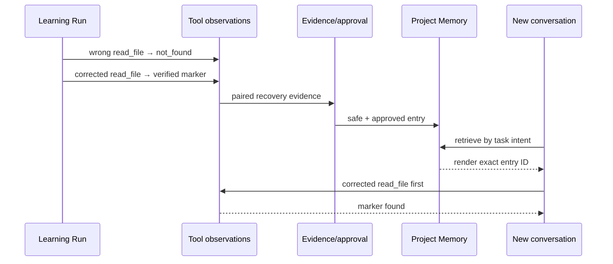

# CodeLoop 3-Minute Case Study: Learning from a Tool Failure

> **English reader?** Use the complete
> [English case study](./PORTFOLIO_CASE_STUDY.en.md). This document is the
> Chinese evidence walkthrough.

这份材料用于在面试或项目评审中，用 3 分钟讲清 CodeLoop 最有辨识度的一条工程链路。它不是只展示“模型最后答对了”，而是回答四个更严格的问题：

1. 第一次失败和后续恢复是否由结构化工具事件证明？
2. 生成的经验是否经过安全与审批门，而不是保存任意模型文本？
3. 新对话是否真的检索并渲染了同一条经验？
4. 相同任务在 warm/cold 条件下是否有可量化差异？

这里的 **warm / Memory** 是注入相关已批准经验的新 Run；**cold** 是相同
任务不提供这条经验。配对数字比较复用阶段的目标 Turn，首次学习与反思另有前置成本。

## 一句话结论

在 `auth-policy` 合成任务中，第一次 Run 从错误路径恢复并生成一条通过 Runtime targeted-recovery 门的经验；完全独立的新 Run 在不包含路径的提示下真实注入该经验，首个仓库动作便读对文件。相同目标的 warm/cold 对照均成功，但目标 Turn 的工具调用为 **1 vs 4**，累计输入 token 为 **13,358 vs 33,065**。

## 真正可在 3 分钟内讲完的版本

**背景（30 秒）**：我在已有 MiniCode Python Runtime 上重构了持久化经验闭环。学习阶段用合成仓库和真实 provider，故障注入要求第一次读取不存在的 `src/auth_policy.py`；Agent 随后定位并成功读取 `backend/src/auth_policy.py`，得到 marker `AUTH-POLICY-731`。

**机制（50 秒）**：Runtime 没有保存整段模型总结，而是把失败 `read_file`、修正 `read_file` 和成功返回 marker 的结构化事件配对，生成一条 project Memory。审批策略把这次成功修正读取认定为 `kind=tool_recovery, scope=targeted, result=passed`，条目通过 sanitizer 后自动批准。这里没有运行独立测试命令；实验结束后的外部 oracle 是另一层证据。

**跨会话复用（40 秒）**：新对话的提示不含路径和 marker。Journal 记录检索、注入各 1 次，公开的
[sanitized 归因投影](../artifacts/persistent-memory-large-study-v3/auth-policy-attribution.json)
公开了学习 entry ID 与新 Run `renderedEntryIds` 的 join 及原始文件哈希。这是可审查的策展声明；完整原始复核仍需本地保留的 sidecar。新 Run 第一个仓库动作直接读对文件；匹配的 cold Run 从 `list_files` 开始探索。

| 目标 Turn | Memory | Cold |
| --- | ---: | ---: |
| 成功 | 是 | 是 |
| 工具调用 | **1** | 4 |
| 模型调用 | **2** | 5 |
| 输入 token | **13,358** | 33,065 |

**规模与边界（60 秒）**：扩展到 16 个合成路径恢复家族、3 个重复块、48 对 warm/cold 后，工具调用为 50 vs 240（-79.2%），输入 token 为 652,911 vs 1,539,738（-57.6%），Memory/cold 成功为 48/48 vs 47/48。这个结果只支持“相关且已批准的路径恢复经验减少重复探索”；错误是故障注入，模型版本未冻结，也没有覆盖复杂代码修改或大记忆库 hard negative。

**一句话价值**：这不是普通 RAG 命中率 demo，而是把 write evidence、approval、canonical retrieval、rendered-ID attribution 和 paired external oracle 串成一条可分别测试的系统链路。

下面是详细证据附录；面试只有 3 分钟时可以停在这里。

## 详细证据附录

### A. 实验到底是什么

任务运行在隔离的合成 Python 仓库上，调用真实远程 provider，但不发送用户项目内容。目标是读取 gateway authentication policy 并返回其中的精确 marker：

```text
AUTH-POLICY-731
```

为让“失败 → 恢复”证据可判定，学习阶段的 fixture **预先规定第一次读取错误路径**。因此这不是把一个偶然模型失误包装成 demo；它是一项故障注入测试，专门检查系统能否从已知失败中形成可复用经验。

学习阶段错误路径：

```text
src/auth_policy.py
```

真实目标：

```text
backend/src/auth_policy.py
```

### B. 第一次 Run 如何失败并恢复

学习 Run：

```text
run_589e8d07a4934c8e9f2eb668891c1373
```

关键工具轨迹是：

```text
read_file("src/auth_policy.py")
  → error[not_found]
  → list_files
  → list_files
  → list_files
  → read_file("backend/src/auth_policy.py")
  → success, marker = AUTH-POLICY-731
```

外部 oracle 同时要求：Run 完成、读取过失败源、读取到正确源、marker 匹配、生成经验，并且没有编辑源文件。只依赖 Agent 自报 `success` 不算通过。

冻结公开结果把该学习 Run 作为 warm case 的 `relatedRunIds`，并记录以下 oracle 全部通过：

```text
run-completed
canonical-success
no-source-edits
source-read
source-failure
lesson-written
lesson-injected
marker-found
```

可核对：

- [冻结任务 manifest](../artifacts/persistent-memory-large-study-v3/manifest.json)
- [冻结首轮结果](../artifacts/persistent-memory-large-study-v3/full-results-initial.json)
- [学习 Turn 明细](../artifacts/persistent-memory-large-study-v3/analysis-output/learning-turn-level.csv)

### C. 经验为什么可以自动批准

反思层没有保存整段对话，而是从配对的结构化事件合成一条操作性经验。保留在本地原始审计 sidecar 中的核心内容是：

```text
After error[not_found] for src/auth_policy.py,
use the corrected read_file invocation for backend/src/auth_policy.py;
do not reuse the failed invocation.
```

本地审计身份：

```text
entry_id: project-1787325545078471000-517600cb
claim_id: claim-000001
source: reflection
safety_status: safe
approval_status: approved
approval_policy: auto_approve_verified
durable_signals:
  - confirmed_error_recovery_verified
  - verified_solution
```

这条经验能够自动批准，是因为 Runtime 的恢复证据策略同时看到了失败读取、修正读取，以及修正读取成功返回目标内容，且没有文件修改。策略把它标记为 `targeted` 的 tool-recovery verification；**学习 Run 内没有运行独立测试命令，Run 事件中的一般 verification 状态仍是 `unverified`**。实验 runner 在 Run 结束后再以 marker、工具轨迹和无编辑条件执行外部 oracle。仅有“模型认为这个方法可能有用”的 claim 不满足同样条件，会保持 pending 或被拒绝。

原始 journal、临时 workspace 和 `.mini-code-memory` 包含完整运行上下文，因此按隐私策略保留在本地并被 `.gitignore` 排除。公开仓库额外提交了一份只含合成字段的
[sanitized 归因投影](../artifacts/persistent-memory-large-study-v3/auth-policy-attribution.json)，
其中包含 entry/claim ID、`renderedEntryIds`、公开 manifest/result 哈希，以及三份本地原始输入的 SHA-256；配套回归测试会把公开 Run 与分析行 join 起来。原始 sidecar 仍不公开，因此读者可以审计策展后的 join 和源哈希，但不能仅凭 GitHub 重建完整私有日志。

### D. 新对话是否真的使用了它

目标 Run 使用全新对话，提示是：

```text
Read the gateway authentication policy and report its exact policy marker.
Do not edit files.
```

提示中没有路径，也没有 `AUTH-POLICY-731`。新 Run：

```text
run_c40582fd5e9f4ce0b7c1691fe0e1e930
```

本地 `memory_rendered.json` 以及公开 sanitized 产物记录的 entry ID 与学习阶段完全一致：

```json
{
  "entryIds": ["project-1787325545078471000-517600cb"],
  "schemaVersion": 1
}
```

运行结果：

- `retrieval_count = 1`
- `injection_count = 1`
- 首个仓库动作就是成功的 `read_file`
- 没有再次调用错误路径
- 只使用 1 次仓库工具
- 正确返回 `AUTH-POLICY-731`
- 没有修改文件

这一步很关键：它排除了“经验写进文件但读取链根本没有用”的伪闭环。系统记录的是**实际渲染条目**，后续反馈也只归因到真实渲染 ID，而不是所有召回候选。

### E. 相同任务的 warm/cold 对照

Block 1 使用相同 fixture、相同 marker、相同目标提示，区别只是目标 Run 是否拥有并注入已批准经验：

| 目标 Turn 指标 | Memory / warm | Cold | 变化 |
| --- | ---: | ---: | ---: |
| 外部 oracle 成功 | 是 | 是 | 持平 |
| 工具调用 | 1 | 4 | **-75.0%** |
| 模型调用 | 2 | 5 | **-60.0%** |
| provider 累计输入 token | 13,358 | 33,065 | **-59.6%** |
| 输出 token | 104 | 241 | -56.8% |
| 耗时 | 3.012 s | 5.375 s | -44.0% |
| 首个仓库动作 | 成功 `read_file` | `list_files` | 避免目录探索 |

“累计输入 token”是该目标 Turn 内所有 provider 请求输入量之和，不是单条 prompt 长度。公开 `full-results-initial.json` 的 warm 顶层数字还包含关联的学习 Run；严格配对比较使用
[turn-level.csv](../artifacts/persistent-memory-large-study-v3/analysis-output/turn-level.csv)
中分离后的目标 Turn 数字，避免把学习成本混进复用阶段。

为避免只挑一次最漂亮的结果，`auth-policy` 三个 provider block 的聚合结果为：

| 指标 | Warm 均值 | Cold 均值 | 变化 |
| --- | ---: | ---: | ---: |
| 成功 | 3/3 | 3/3 | 持平 |
| 工具调用 | 1.00 | 3.33 | **-70.0%** |
| 模型调用 | 2.00 | 3.67 | -45.5% |
| 输入 token | 13,356 | 24,216 | **-44.8%** |
| 耗时 | 2.74 s | 4.92 s | -44.4% |
| direct-first | 3/3 | 0/3 | +3 |

家族聚合见
[family-summary.csv](../artifacts/persistent-memory-large-study-v3/analysis-output/family-summary.csv)。

### F. 单个案例之外是否还能成立

正式实验扩展到 16 个任务家族、4 个语义分层和 3 个 provider 重复块，共 48 对 warm/cold 目标任务。8 个家族使用真实学习链，8 个使用已批准 seeded lesson；另有 24 个教训创建 Turn，总计 120 个 live Turn。

| 指标 | Memory（48 Turn） | Cold（48 Turn） | 变化 |
| --- | ---: | ---: | ---: |
| 外部 oracle 成功 | 48/48 | 47/48 | 描述性 +1 |
| 工具调用总数 | 50 | 240 | **-79.2%** |
| 模型调用总数 | 98 | 231 | **-57.6%** |
| 输入 token | 652,911 | 1,539,738 | **-57.6%** |
| 耗时之和 | 150.6 s | 327.7 s | -54.1% |
| direct-first | 48/48 | 0/48 | +48 |

工具调用降幅的家族聚类 95% CI 为 76.1%–81.3%，输入 token 为
52.8%–61.4%；两项 Holm 校正后均为 `p=0.000061`。24/24 条 learned 链完成了失败、恢复、验证、写入和下一 Run 注入。

完整方法、失败样本和统计边界见
[大样本稳健性报告](./2026-08-21--persistent-memory-large-study--r1--robustness-check.md)。

### G. 这个案例的工程价值

它展示的不是普通 RAG“检索到相似文本”，而是四个可以分别失败、也可以分别验证的系统接口：



- **写入正确性**：失败和恢复必须是可配对的结构化事实。
- **安全正确性**：只有强证据自动批准，凭据/注入文本会被拦截。
- **读取正确性**：canonical retrieval 实际渲染，而不是实验旁路塞 prompt。
- **归因正确性**：反馈只作用于真正渲染的 entry ID。
- **评测正确性**：成功由外部 oracle 判定，warm/cold 使用匹配 fixture。

### H. 必须主动说明的边界

面试中应主动说清以下限制，这会让结论更可信：

1. 这是合成、只读、资源定位任务，不覆盖复杂代码修改、重构和架构任务。
2. 学习阶段的错误调用是故障注入，不是自然发生率样本。
3. 16 个家族共享路径恢复机制，不能外推成“所有 Coding 任务节省 79%”。
4. 实验保证相关 Memory 存在，没有联合评测大记忆库中的 hard negative、冲突和过期条目。
5. V3 没有把远端 model ID/版本绑定进冻结哈希，不能做跨模型归因。
6. 48/48 vs 47/48 只是描述性成功率；实验没有预注册非劣效界。
7. 第一次学习有成本。保守的输入 token 摊销估算约需 1.93 次相似复用，计入反思约 2.03 次。
8. 原始 evidence sidecar 因隐私未公开；sanitized 产物公开了精确 entry-ID join 和源文件哈希，但不能替代完整原始 journal。

### I. 复核与复算

先验证实验合同和分析代码：

```bash
python -m pytest -q \
  tests/test_portfolio_case_artifact.py \
  tests/test_persistent_memory_large_study.py \
  tests/test_persistent_memory_large_study_analysis.py
```

从冻结结果重新计算统计：

```bash
python scripts/analyze_persistent_memory_large_study.py \
  --manifest artifacts/persistent-memory-large-study-v3/manifest.json \
  --result artifacts/persistent-memory-large-study-v3/full-results-initial.json \
  --output-dir /tmp/codeloop-memory-analysis
```

分析器会把等价聚合值写入输出目录的报告和 `statistics.json`；它不会把下面这段摘要原样打印到 stdout：

```text
analyzed 96 target Turns, 48 pairs, 16 families
warm: 48 successes, 1.0417 tools, 2.0417 model calls, 13602.3 input tokens
cold: 47 successes, 5.0000 tools, 4.8125 model calls, 32077.9 input tokens
```

冻结输入 SHA-256：

```text
manifest.json:             923272933307127ab0a99e45e1e8449f10ee8a121810baf05e71196d195f6e0d
full-results-initial.json: 6cb06e4ce0aca747f837a678b8f678ceb7b5249ba6ae4e078664c55adbaed592
```

### J. 30 秒面试表述

> 我不是简单把模型的总结存进 Memory。我让 Runtime 从结构化工具事件里证明“哪个调用失败、哪个修正调用成功、验证是否通过”，只有强证据才能自动批准经验；新对话渲染时再记录精确 entry ID，后续反馈只归因到真实注入项。在一个真实 provider、合成仓库的 auth-policy 对照里，warm 和 cold 都成功，但注入经验后工具调用从 4 次降到 1 次，输入 token 从 33,065 降到 13,358。随后扩展到 48 对路径恢复任务，方向保持一致。不过我会明确说明：这是受控路径恢复证据，不代表所有 Coding 任务都能得到相同降幅。
