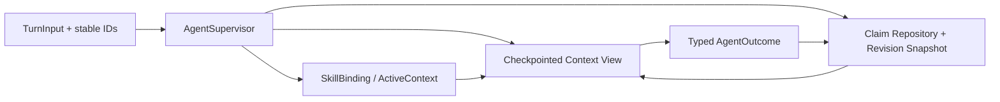

# MiniCode Coding Agent 四域复审（2026-08-19）

## 结论

MiniCode 已经从“组件堆叠”进步到有路由、观测、审批、预算、摘要和反馈的数据链路，
但还没有形成一个由强不变量约束的 Agent Runtime。

更准确的产品定位是：

> **适合人类在环的研究与内测；暂不适合无人值守、可写入、长上下文任务。**

本轮没有确认 P0，但确认了多组 P1。最大的风险不是某个模块完全不可用，而是四条
链路各自“看起来成功”时，实际执行状态可能已经分叉：

- Skill 被路由，不代表对应版本被加载，更不代表压缩后仍在生效；
- 子 Agent 返回，不代表任务成功，也不代表超时 Worker 已停止写入；
- Memory entry 被批准，不代表其中每条 claim 都被同等级证据支持；
- Compact 返回 success，不代表覆盖了全部被删除历史，也不代表 Token 真的减少。

| 领域 | 当前成熟度 | 发布判断 |
|---|---|---|
| Skill 路由 | 相关性选择和 telemetry 已明显成熟；执行绑定、安全边界、持续生效仍断裂 | 不通过长任务执行门 |
| 多 Agent | 有隔离、深度限制、并行 explore、mailbox/journal；本质仍是同步嵌套 Agent Loop | 不通过可取消写任务门 |
| 持久化记忆 | 证据提取、校验、审批、canonical retrieval 已较完整；claim、revision、事务边界不完整 | 不通过 authority 一致性门 |
| 上下文压缩 | 策略和观测丰富；存在确定性信息丢失、索引失效和反向膨胀 | 不通过长上下文正确性门 |

本报告审查当前工作树快照：`main@93052e3` 加上用户尚未提交的修改。工作树原本已
有大量改动，因此结论针对当前快照，不等同于对 `93052e3` 单独认证。本轮未修改生产
代码。

## 优先级发现

### P1-1：Skill 缺少不可变绑定，发现、路由、加载和归因可能不是同一个版本

发现阶段从 frontmatter 生成公开名称与 digest，加载阶段却重新把公开名称解释成物理
目录；长驻 TUI 又持有旧 catalog，而 loader 每次读取磁盘 live 内容。

- `minicode/skills.py:172-181,263-299,334-373`
- `minicode/tools/__init__.py:155-156`
- `minicode/tooling.py:367-382`
- `minicode/main.py:228,359`

已复现：目录为 `folder-name`、frontmatter 为 `name: public-name` 时，路由会广告
`public-name`，但 `load_skill("public-name")` 返回空。运行中改写正文还会形成“旧 digest
路由、新正文执行”，使 `skill.routed@v2`、`skill.loaded` 和 evidence ledger 的版本 join
失真。

同时，“匹配后必须加载”只存在于 prompt：`minicode/agent_loop.py:1991-1999` 会接受
未加载 Skill 的 final；`explore` / `plan` 白名单甚至没有 `load_skill`
（`minicode/tools/task.py:61-88,734-778`）。

**建议**：发现时生成不可变 `SkillBinding {id, public_name, resolved_path, root_id,
digest, version}`；后续只按 binding 加载，加载前再次校验 digest。匹配后必须满足
“精确 binding 已加载”或记录显式 waiver，不能只依赖提示词。

### P1-2：项目 Skill 可通过符号链接逃逸 Workspace

`discover_skills()` 与 `load_skill()` 会跟随 Skill 目录或 `SKILL.md` 的 symlink，读取
Workspace 外文件并把它标记为 `source=project`：

- `minicode/skills.py:167-170,204-219,334-355`

临时 Workspace 探针已成功从外部目录发现并加载正文。现有测试只覆盖名称中的 `../`
和绝对路径，没有覆盖目录、文件及 root symlink。

**建议**：对每个候选执行 `resolve(strict=True)`，验证解析后文件位于解析后的受信 root
内；拒绝 symlink root、symlink Skill 目录和 symlink 正文，错误必须 fail closed。

### P1-3：Skill 正文不是 Active Context，压缩后规则消失但归因仍继续

Skill 正文仅作为普通 tool result 注入：

- `minicode/tools/load_skill.py:29-38`
- `minicode/tooling.py:35-50,443-445`
- `minicode/context_compactor.py:761-795,1022-1061,1096-1115,1248-1268`
- `minicode/agent_loop.py:2225-2233,2383-2387`

超过 50k 时它先经过 generic head/tail 截断；Full Compact 给摘要器的单条 tool result
最多约 160 字符；heuristic 路径对非错误结果不保留。强制压缩探针中，Skill 的唯一规则
marker 完全消失，但进程内 `SkillUsageTracker` 仍会产生 attribution。这会同时损害执行
正确性和后续效果评估。

**建议**：把已加载 Skill binding 与必要指令放入独立 `ActiveContext`，压缩后按 digest
重新注入；attribution 必须证明该 binding 在最终有效上下文中持续存在。

### P1-4：Turn 预算不是端到端共享，且并行请求没有原子预留 Token

Dashboard / Headless 的标准入口没有把 runtime 传入 `run_agent_turn`
（`minicode/agent_runtime.py:93`）；`minicode/agent_loop.py:947` 因此可能在子层重新创建
预算。`minicode/agent_budget.py:154` 预留 model-call 数，却没有原子预留预计 Token/成本。
两个并发 90-token 请求都可以通过 100-token 上限，最终达到 180/100。

**建议**：顶层请求创建唯一 `TurnBudget` 并显式传给所有子 Agent；reserve 必须原子扣减
预计 Token/成本，finish 时结算差额。并行分支必须先取得 lease，不能先执行后记账。

### P1-5：子 Agent 超时后仍可能作为孤儿 Worker 继续写入

子任务由 `ThreadPoolExecutor` 执行；超时后 `shutdown(wait=False)` 不能终止正在运行的
线程（`minicode/agent_loop.py:448`）。abandonment 只在 Agent Loop 边界检查
（`minicode/agent_loop.py:1348`），Provider、工具或外部调用阻塞期间无法生效；`general`
子 Agent 又拥有完整写工具（`minicode/tools/task.py:726-738`）。

因此父任务可以已经返回 timeout，子线程随后仍修改代码、Memory 或外部系统。

**建议**：写入型子 Agent 必须运行在可终止的隔离边界中；至少使用 cooperative cancel +
每次写入前 fencing token，较稳妥方案是独立进程/受控 worktree，父任务撤销 lease 后任何
迟到写入都被 Store/Tool 层拒绝。

### P1-6：子 Agent 没有 typed outcome，失败和评审失败会被包装成成功

`task` 工具把 `run_agent_turn()` 正常返回解释为 completed
（`minicode/tools/task.py:831,874,996`），但 Provider timeout、网络错误、步数耗尽会被
Agent Loop 转成普通 assistant fallback（`minicode/agent_loop.py:1554,1583`）。workflow
评审失败也会在输出里标失败，却把 journal 记为 completed，并以 execute 阶段决定整体
success（`minicode/tools/task.py:565,594`）。

**建议**：统一返回 `AgentOutcome {status, reason, answer, verified, writes, usage}`，状态至少
包含 `succeeded / failed / timed_out / cancelled / exhausted / partial`；workflow 的 required
review 失败不得被 execute 成功掩盖。

### P1-7：Dashboard 用压缩前索引解释压缩后的消息列表

执行前记录 `user_index` 和 `assistant_start`（`minicode/conversation.py:709-716`），运行中
消息列表可能被整体替换（`minicode/agent_loop.py:1268-1270,1657-1660,2265-2268`），但提交
时仍使用旧索引（`minicode/conversation.py:754-779`）。探针得到：

```text
assistant_start=22, compacted_result_len=4, new_assistant=None
```

有效回复会因此变成 `ConversationTurnFailed`；即使碰巧找到 assistant，旧 user marker 也
可能在保存时被裁掉，破坏幂等重放。

**建议**：消息和 turn 使用稳定 ID，不跨 runtime 保存位置索引；runtime 返回显式
`TurnOutputMetadata`，提交时按 ID 在最终列表重新定位。

### P1-8：两条压缩路径都违反“删除内容必须被摘要或保留”

Full Compact 从最老消息开始构造最多 24k 字符的摘要输入，然后独立保留最新 tail：

- `minicode/context_compactor.py:751-807,984-995,1015-1061`

当历史足够长时，中间区既不进入摘要，也不在 tail。sentinel 探针稳定得到
`in_llm_prompt=False` 且 `in_compacted_tail_or_summary=False`。

Session Memory Compact 则把检索到的 durable memory 当成被删除当前 transcript 的唯一
摘要（`minicode/context_compactor.py:583-590,627-668`）。而当前 turn 的经验要到任务结束
才可能写入 durable memory（`minicode/agent_loop.py:2443-2451`），所以本轮决策、工具结果
和恢复过程会静默消失。

**建议**：先计算精确 `dropped` 集合，再对该集合分块/层级摘要；每个 dropped message
必须有“被保留或进入某个摘要输入”的覆盖证明。Durable memory 只能补充，不能代替
episodic transcript checkpoint。

### P1-9：Memory 检索没有 fail-closed、带 revision fence 的 authority snapshot

Manager 初始化和读路径直接使用 `exists/read_text`，没有调用写路径的 root 校验
（`minicode/memory.py:1787-1793,2014-2083,2138-2196`）；刷新失败继续使用旧视图
（`minicode/memory.py:1725-1735`），Retriever 又吞掉刷新异常
（`minicode/memory_retrieval.py:756-766`）。refresh 与复制 active entries 之间也没有锁或
revision token。

结果是并发 reject/delete 后，旧 approved entry 仍可能进入一次 prompt；symlinked
Project/Local root 也可能把另一工作区的记忆读入当前 Agent。

**建议**：Repository 提供单一 `snapshot_for_retrieval() -> {revision, entries}`，在同一
锁与路径校验边界中刷新、验证、复制；渲染/提交前校验 revision，失败一律不注入。

### P1-10：Memory 的审批粒度是 entry，不是 claim

`memory_pipeline.py:624-631` 从整条 Reflection 聚合 durable signal，然后在
`633-664` 把全部 structured claims 写成一个 entry。一个已验证 recovery 可以让同 entry
内无独立证据的 decision 一起自动 active。

**建议**：一个 claim 一个 identity、evidence chain 和审批状态；如果暂时保留多 claim
entry，则整条 entry 必须采用最弱 claim 的审批策略，而不是最强 signal 的策略。

### P1-11：ProjectFacts 会把失败的安装命令记为 confirmed dependency

`_extract_libraries()` 只看到 `pip install/add` 命令就标记 confirmed，不检查结果
（`minicode/reflection_evidence.py:1456-1475`）；随后 `memory_pipeline.py:562-565,829-853`
将它移入绕过审批的 ProjectFacts。探针中失败的 `pip install bogus_pkg` 仍产生
`Project confirmed dependencies: bogus-pkg`。

`minicode/project_facts.py:36-42` 又不保存 event、command outcome、manifest 或 provenance，
也没有等价 delete/supersede/repair 生命周期。

**建议**：confirmed 只能来自成功工具结果或锁文件/manifest 的读取证据；ProjectFacts
必须保留 Run/Turn/事件 provenance，并使用与 Memory claim 相同的纠正、删除和审计协议。

### P1-12：Memory authority 与 approval audit 不是一个可恢复事务

`_append_approval_audit(save=True)` 会先落盘 audit（`minicode/memory.py:2198-2255`），
随后才写 authoritative `memory.json`；reject 路径见 `3479-3489`。若第二次写失败或进程
崩溃，重启后可能出现“audit 显示 rejected，entry 仍 approved/active”。单文件
`os.replace`（`3121-3154`）无法提供跨文件原子性。

**建议**：用 WAL/commit manifest 或单一事务文件提交 entry、audit、Markdown 派生物；
重启时 replay/rollback。Markdown 应是可重建 projection，不应参与 authority 决策。

### P1-13：Memory scope ownership 与测试数据根仍不完整

普通个人事实固定写 PROJECT（`minicode/memory_pipeline.py:732-750`），且缺少
Session/Turn/Run provenance；`MemoryPaths.for_workspace()` 又始终把 USER 指向真实
`~/.mini-code/memory`（`minicode/memory.py:1557-1565`）。部分 tmp-workspace 测试没有
注入隔离的 USER root，具备污染真实用户 Store 的条件。

**建议**：显式注入所有 storage roots；全套测试使用 autouse 临时数据根，并对真实用户
根做前后 hash 不变检查。增加 personal/project/local scope classifier 和统一 forget API。

## P2 与工程性缺口

1. **Embedding cache 身份不足**：`minicode/skill_semantics.py:375-411,522-523` 保存但不校验
   model/provider，只以正文 digest 取向量；切换模型会复用不兼容向量。缓存也没有验证
   数值和维度，`SkillRouter` 只捕获 `EmbeddingUnavailable`
   （`minicode/skill_router.py:417-427`）。
2. **子 Agent prompt/tool contract 不一致**：`explore/plan` 缺少 `load_skill`；parallel
   explore prompt 还要求 `subagent_note_write`，但 explore 白名单没有该工具
   （`minicode/tools/task.py:61-88,364-366`）。
3. **Sidecar journal 首次建目录有并发竞态**：`minicode/subagent_journal.py:188` 使用
   `if not exists(): mkdir()`，parallel explore 可能让部分分支静默失去 journal。
4. **Recurrence 不是 supersession**：任一 semantic key 命中就吞掉整批新 claims
   （`minicode/memory_pipeline.py:592-618,855-888`）；partial overlap、新旧冲突、拒绝后修正
   和并发 writer 都没有被建模。
5. **Full Compact 可重复 protected user**：先插入最后一个 dropped user，再在 token-floor
   回扩时恢复同一消息（`minicode/context_compactor.py:1028-1059`）。
6. **Cybernetic 策略没有真正驱动执行器**：FULL/SESSION/force 被降成 enable 布尔值，仍受
   固定 85% 阈值和 dispatcher 自选策略影响
   （`minicode/context_cybernetics.py:723-747`，`minicode/context_compactor.py:948-962,
   1375-1377`）。
7. **Force compact 可反向膨胀仍被应用**：探针从 54 tokens 变成 2069，但因消息数 6→4，
   调用方仍替换原上下文（`minicode/context_compactor.py:1063-1083,1421-1423`；
   `minicode/agent_loop.py:1424-1430,2723-2729`）。
8. **Dashboard 控制器状态不跨轮**：每轮创建新的 `ContextManager`
   （`minicode/conversation.py:688-692`，`minicode/agent_runtime.py:189-224`），PID、预测器、
   adaptive threshold、read dedup 等状态每轮重置。

## 已确认的进步

### Skill

- 旧版“unknown 时返回全部 Skill”和 capability availability 误造相关性已修复；已有真正的
  abstain、confidence gate、严格 alias coverage、examples 证据和 top-k。
- `skill.routed`、`skill.loaded`、canonical outcome、`skill.attributed` 已形成可观测链路。
- Evidence/version ledger 有锁、原子替换、digest lineage、样本门与 Wilson 区间；尚未把
  相关性 shadow 信号越权接入在线 promotion/rollback，这个克制是正确的。

### 多 Agent

- 子 Agent 拥有独立 messages、ContextManager、Skill tracker；深度限制和移除 `task` 工具
  避免无限递归。
- read-only explore 可并行，写分支默认串行；mailbox 有锁、key 校验和大小限制；sidecar
  journal 避免把完整子上下文塞回父 prompt。

### Memory

- Evidence extractor 不再直接相信 task wording；Validator 和 Value Gate 已检查 evidence
  type、statement alignment、safety、epistemic status 和 verified recovery。
- 生产注入已收敛到 canonical retriever；selected/rendered IDs 分离，RunJournal 可把用户
  correct/reject 绑定到本轮真正写出的 lessons。
- 写路径的 symlink containment、`flock`/RLock、UTF-8 size、capacity tombstone 与 backlink
  清理比旧版完整。

### Context

- Tool call/result tail cut 已按精确 ID 配对，并兼容新旧 schema。
- 旧 boundary marker 会先移除；超大 tool output 使用原子持久化并有路径/symlink 校验。
- Provider token observation 已参与估算校准；LLM 摘要调用有界并计入共享预算。

## 根因判断

四域的共同根因不是“缺少更多策略”，而是缺少四个深模块：



1. **AgentSupervisor**：独占 Agent handle、状态机、预算 lease、取消、超时 fencing 与 typed
   outcome；`task` 只是它的 Adapter。
2. **ActiveContext / TurnCheckpoint**：稳定 message/turn ID；明确保护当前用户指令、已加载
   Skill bindings、计划、未决 tool pair、验证结果和文件变更；压缩只是它的派生视图。
3. **SkillBinding Repository**：发现、加载、版本、digest、根目录权限使用同一 identity，禁止
   根据名称二次寻址。
4. **Claim Repository**：claim-level identity、evidence、scope、revision、supersedes/
   retracted_by；读写、审批和审计共享事务边界。

## 建议实施顺序

### Batch A：Correctness firewall

先修稳定消息 ID、Dashboard commit、精确 dropped-set 摘要、Session Memory 补充语义、
no-negative-savings gate。加入 head/middle/tail sentinel 和重复消息测试。

### Batch B：Supervisor safety

建立顶层共享预算、原子 token lease、typed outcome、写入 fencing 和可终止 Worker；修复
workflow review 与 sidecar race。

### Batch C：Skill binding

落地 resolved-path containment、不可变 binding、digest revalidation、load runtime guard 和
压缩后的 Active Skill reinjection；随后再修 embedding cache identity。

### Batch D：Memory authority

拆成 claim-level entry，加入 revision-fenced snapshot、supersession、ProjectFacts provenance、
scope classifier、隔离测试根和 WAL/recovery。

在 A–D 的不变量门通过前，不建议继续扩大自适应调参、自动 Skill promotion 或自动 Memory
强化；否则只会让错误状态更快地反馈回系统。

## 必须新增的发布门

1. 每条 dropped message 必须被保留或进入摘要输入；head/middle/tail sentinel 全覆盖。
2. Compact 后 Token 不得增加，protected messages 不得重复，tool pair 不得断裂。
3. 同一 Dashboard turn 经压缩后仍可提交、重载和按 `turn_id` 幂等重放。
4. 超时/取消后，子 Agent 不能产生任何迟到写入；并发 Token reservation 不得超预算。
5. required review 失败必须得到非 success typed outcome。
6. 被路由 Skill 必须加载同一 binding/digest，压缩后仍在 Active Context；symlink escape 必须
   fail closed。
7. refresh 后并发 reject 的 Memory 不得进入 prompt；读取 root symlink 必须 fail closed。
8. 强弱混合 claims 不能搭车自动批准；same-key correction 必须 supersede 而非强化旧结论。
9. 失败的 `pip/npm install` 不得生成 confirmed fact；所有 fact 必须可追溯、纠正和删除。
10. audit 与 authority 任一点 fault injection 后，重启状态必须一致；测试不得触碰真实 USER
    store。

## 本轮验证

相关 suite 均为绿色，但没有覆盖以上跨模块不变量：

- Context/turn/cybernetics 集合：`205 passed`；独立交叉集合：`151 passed`。
- Skill/router/version/evidence/sub-agent isolation：`101 passed`；Context compactor：`69 passed`。
- 多 Agent 聚焦集合：`51 passed`。
- Memory 安全集合：`14 passed`；reflection/approval 集合：`132 passed`。

这些集合存在重叠，数字不可相加。绿色结果证明现有局部行为稳定，也同时说明本轮发现主要
属于测试 oracle 和跨模块契约的覆盖缺口。
