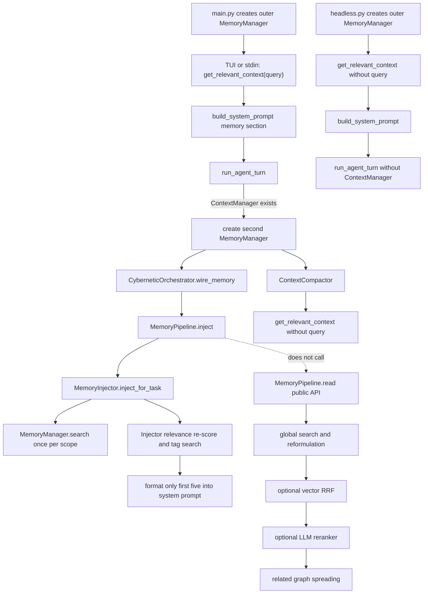

# Memory Retrieval Production Chain Audit

## Scope And Method

This audit freezes the current implementation as observed on 2026-07-15. It
distinguishes source declarations, actual callers, test-only coverage, and
unwired capabilities. No production retrieval, ranking, injection, feedback,
safety, persistence, reflection, approval, or curator code was changed.

Evidence combines direct source inspection and the 80-case offline evaluator.
All dynamic probes use synthetic entries and temporary USER/PROJECT/LOCAL roots.

## Actual Call Graph

The three central APIs do **not** converge:

- `get_relevant_context(query=...)` performs scope-sequential retrieval and budgeting.
- `MemoryPipeline.inject` bypasses `MemoryPipeline.read` and calls the Injector.
- `MemoryPipeline.read` has no production caller in `minicode/`; it is a public,
  tested capability rather than the current prompt-injection path.

## Entrypoint Inventory

| Entrypoint | Source | Manager ownership | Query | Files/domains | Final prompt mutation |
|---|---|---|---|---|---|
| Interactive TUI | `minicode/tui/input_handler.py:399-412` | Outer manager from `main.py:238-240`, passed at `main.py:385-396` | Submitted input | No files/domains supplied to manager context | Replaces system message through `build_system_prompt` |
| stdin, non-TTY | `minicode/main.py:299-372` | Outer manager from `main.py:238-240` | Current input line | No files/domains supplied | Replaces system message at `main.py:349-361` |
| headless | `minicode/headless.py:69-108` | Headless manager | **No query** | None | Builds system message before user message |
| Agent orchestrator | `minicode/agent_loop.py:755-836` | New inner manager, not the TUI/stdin manager | Work-chain `task.raw_input` | `current_files` omitted at `agent_loop.py:794-798`; domains therefore empty | Pipeline appends to first system message |
| Agent fallback | `minicode/agent_loop.py:801-827` | Same inner manager as compactor | `task.raw_input` | No files; signal has no active domains | Appends `## Injected Memory` |
| Context compaction | `minicode/context_compactor.py:667-680`, `:453-473` | Inner manager passed at `agent_loop.py:830-836` | **No query** | None | Creates compact boundary using memory as summary base |
| Compatibility helper | `minicode/memory.py:3381-3400` | Caller-provided manager | **No query** | None | Returns prompt plus `Project Memory & Context` |
| Pipeline.read | `minicode/memory_pipeline.py:243-307` | Pipeline manager | Public task description | Public files/domains | Does not write a prompt; returns dictionaries |
| Failure recovery | `minicode/memory_injector.py:321-392` | Injector manager | Tool name plus first 100 error characters | No active domains | Returns `InjectedMemory`; no production caller found |
| Tag search | `minicode/memory_injector.py:463-504` | Injector manager | Up to three hard-coded keywords from task | None | Added to Injector candidates before prompt formatting |
| Related graph | `minicode/memory_pipeline.py:625-669`; manager API at `memory.py:3328-3356` | Pipeline/manager | Seed IDs, not text | None | Pipeline.read only; no production injection caller |

## Per-Path Semantics

### TUI And stdin

1. The outer manager handles memory commands first (`input_handler.py:301-307`
   or `main.py:315-320`).
2. Query-aware `get_relevant_context` is evaluated before the user message enters
   the agent loop (`input_handler.py:399-412`, `main.py:349-361`).
3. `get_relevant_context` searches in fixed `LOCAL -> PROJECT -> USER` order and
   consumes one shared token budget (`memory.py:2422-2450`). There is no
   cross-scope global result list.
4. `build_system_prompt` writes the result into its dynamic memory section
   (`prompt.py:280-291`).
5. With a context manager, `run_agent_turn` creates a second manager and invokes
   Pipeline injection. The two manager objects load the same persistent files but
   have independent caches and counters in memory. The evaluator reproduced the
   same entry twice in one final system prompt.

Exceptions from the initial manager context are not locally swallowed. Pipeline
injection inside the agent loop is inside broad `except Exception: pass` blocks
(`agent_loop.py:791-800`, `:801-829`).

### headless

`headless.py:93` calls `get_relevant_context()` without the task prompt even though
the prompt is already available at `headless.py:80`. The no-query branch emits all
active entries by fixed scope order until budget (`memory.py:2452-2482`). The
headless `run_agent_turn` call does not pass a `ContextManager`, so the second
Pipeline injection is not initialized. A synthetic no-match task still received
both unrelated active memories in the dynamic reproduction.

### Agent Orchestrator And Fallback

The inner manager is created only when `context_manager` is truthy
(`agent_loop.py:755-765`). It is wired to the orchestrator and the same manager is
given to ContextCompactor (`agent_loop.py:783-836`). The orchestrator creates a
`MemoryPipeline` and enables a reranker with the live agent model by default
(`cybernetic_orchestrator.py:211-226`).

`orch.inject_memories` receives no `current_files` argument from the agent loop,
so its default is `None` (`cybernetic_orchestrator.py:420-433`). Pipeline inject
then derives domains only when files exist (`memory_pipeline.py:335-350`). The
controller's `retrieval_quality` is fixed to `0.5`; recent failure, user correction,
and repetition signals are not populated on this path.

If no orchestrator exists, the fallback calls the Injector directly. In the
current initialization structure that branch is defensive; normal work-chain
execution creates an orchestrator first.

### Context Compaction

At the auto-compact high-water mark, session-memory compaction is tried before
full compaction (`context_compactor.py:650-681`). It calls no-query
`get_relevant_context(max_tokens=6000)` (`:470-473`). This path performs no text
ranking and does not increment retrieval counters. It can therefore use unrelated
active persistent memory as the summary base.

### Compatibility Helper

`inject_memory_into_prompt` calls no-query manager context and wraps it in another
prompt section (`memory.py:3381-3400`). It has test and compatibility callers but
no current `main.py`, TUI, or headless caller. If a caller already used the modern
prompt memory section, it can duplicate context.

### MemoryPipeline.read

The declared architecture says `read -> inject`, but implementation differs:

- `read` calls global `MemoryManager.search`, may reformulate up to two variants,
  optionally merges vector ranks, optionally calls the LLM reranker, and appends
  graph neighbors (`memory_pipeline.py:243-307`, `:600-669`).
- `inject` calls `MemoryInjector.inject_for_task` directly
  (`memory_pipeline.py:311-372`).

No `minicode/` caller invokes `MemoryPipeline.read`. Vector search and graph
spreading are therefore absent from the actual production prompt-injection path.

### Failure Recovery, Tags, And Graph

- `inject_on_failure` runs three scoped manager searches, then applies category
  and tool-name boosts. It records injection IDs but has no production caller.
- Tag retrieval is active inside normal Injector retrieval. It uses exact tag
  lookup, filters `entry.is_active`, but does not increment `retrieval_count`.
- Pipeline graph spreading appends direct neighbors from the top five seeds. The
  comments declare decay `0.5` and threshold `0.3`, but the implementation applies
  neither value to admission or ordering. The manager's public BFS follows links
  only inside the scope where the seed was found.

## Ranking, Counts, And Persistence

### Manager Global Search

`MemoryManager.search(scope=None)`:

1. Calls `MemoryFile.search` once for each USER/PROJECT/LOCAL scope.
2. `MemoryFile.search` excludes entries failing `is_active`, scores BM25 plus
   substring/tag, domain, usage, feedback, and recency, and increments
   `retrieval_count` for its top ten (`memory.py:1287-1370`).
3. The manager saves every scope with any hit before final filtering
   (`memory.py:2304-2308`).
4. It applies cross-scope `_global_rank`, deterministic tie-breaks, normalized
   content deduplication, and final limit (`memory.py:2321-2340`).

Consequently, a read operation performs persistent writes. Results filtered out
later can still receive retrieval counts and trigger I/O.

### Manager Context Query

The query branch invokes scoped manager search three times. It receives ranking
within each scope, but does not merge scopes globally. `max_entries` is applied per
scope, not as a final global cap. A two-scope synthetic case exceeded that count.

### Injector

The Injector loops through scopes and calls manager search with a per-scope limit
(`memory_injector.py:228-240`). It then discards the manager/BM25 ordering signal
and recalculates every candidate using a base `0.5`, category keyword boosts,
filename mentions, and recency (`:428-461`). The score does not include BM25,
scope, domain, usefulness, or usage.

Candidate iteration uses `memories[:decision.max_memories * 2]` without a final
hard slice (`:273-319`). Pipeline stores all returned entry IDs in
`_last_injected_ids`, while formatting only `injected[:5]`
(`memory_pipeline.py:352-356`). The Injector has already called
`record_injections` for the full returned list (`memory_injector.py:316-319`,
`:394-400`). Agent feedback later uses Pipeline's full `_last_injected_ids`
(`agent_loop.py:1616-1632`).

### Feedback

- Retrieval: top-ten per-scope hits gain `retrieval_count` during search.
- Injection: Injector calls `record_injections` once per returned concrete ID.
- Outcome: the agent feeds back all `_last_injected_ids`.
- Success definition: `tool_error_count == 0`, not final task outcome. A task that
  recovered from one tool error is recorded as memory failure.

All manager feedback methods deduplicate IDs within a call and persist each
touched scope (`memory.py:2497-2537`).

## Existing Test Coverage

Observed test coverage before this phase:

- Manager context and compatibility helper: `tests/test_memory_integration.py`,
  `tests/test_memory_e2e.py`, `tests/test_new_features.py`.
- Lifecycle/safety exclusion: `tests/test_memory_acceptance_audit.py`,
  `tests/test_memory_regressions.py`.
- Injector task/failure/cooldown/controller behavior:
  `tests/test_agent_intelligence.py`.
- Agent integration: `tests/test_agent_flow.py`, `tests/test_agent_loop.py`,
  `tests/test_memory_e2e.py`.
- Session-memory compaction: `tests/test_context_compactor.py:405-476`.
- Pipeline smoke/stress: `tests/test_memory_regressions.py`,
  `tests/test_memory_stress.py`.

Those tests establish feature presence and basic safety. They did not jointly
measure rank metrics, cross-entrypoint agreement, returned/rendered/recorded/
feedback identity, final count limits, negative false injection, or save I/O.
This phase adds those observations without changing production contracts.

## Present But Not Production-Wired

| Capability | Exists | Actual prompt-injection status |
|---|---|---|
| Pipeline query reformulation | `memory_pipeline.py:575-623` | Pipeline.read only; not wired |
| Sparse/dense vector retrieval | `memory_pipeline.py:139-158`, `:268-278` | Disabled by default and Pipeline.read only |
| RRF | `vector_memory.py:196-221` | Pipeline.read only; vector-only IDs cannot enter because output maps only BM25 entries |
| Graph spreading | `memory_pipeline.py:625-669` | Pipeline.read only |
| Failure-recovery injection | `memory_injector.py:321-392` | No production caller found |
| Timeline session context | `timeline_memory.py:1202-1324` | No non-test caller; session files are resumable but not searched for memory injection |
| LLM reranker | `memory_reranker.py:158-205` | Active in agent Pipeline injection when a model exists; disabled in scored baseline arms |

## Verification Isolation Finding

The evaluator itself preserved the formal-memory snapshot across every run. A
separate whole-repository `pytest` verification exposed an existing test-isolation
defect outside the evaluator arms:

- `MemoryPaths.for_workspace()` always maps USER memory to
  `MINI_CODE_DIR / "memory"`, even when the supplied workspace is a pytest
  `tmp_path` (`minicode/memory.py:1432-1441`). Tests in
  `tests/test_new_features.py:444-455`, `:473-484`, and `:530-539` therefore
  wrote `Entry 3`, `Prefer PowerShell examples`, and `Entry` to the real USER
  store.
- Integration session tests call `save_session()` without patching
  `MINI_CODE_DIR` (`tests/test_integration.py:473-527`). The session module writes
  its index to `MINI_CODE_DIR / "sessions_index.json"`
  (`minicode/session.py:140-175`), while only deleting the individual test session
  files afterward.
- The task-start hash snapshot and the post-suite snapshot differ for
  `~/.mini-code/memory/memory.json`, `MEMORY.md`, `approval_audit.json`, and
  `~/.mini-code/sessions_index.json`. The evaluator's own before/after snapshots
  remain equal, and every frozen production source hash remains equal.

This violates whole-suite formal-data isolation even though the offline evaluator
meets its narrower isolation contract. The affected user files were not
automatically reconstructed because no byte-exact pre-test backup was created;
guessing a rollback could destroy legitimate data. Future full-suite runs should
use an isolated `HOME` or patch both memory and session globals before import.

## Facts, Inferences, And Limits

**Facts**

- TUI/stdin and the agent Pipeline can inject the same persistent entry in one turn.
- headless and session compaction use no-query active-memory injection.
- Pipeline.inject bypasses Pipeline.read.
- Returned, rendered, recorded, and feedback IDs diverge when Injector returns more than five entries.
- Most retrieval calls persist counter updates and cause repeated scope saves.
- Existing repository tests can overwrite formal USER memory and append formal
  session-index records unless their process-level home/config roots are isolated.

**Inferences**

- Two manager instances can overwrite each other's stale counter snapshots during
  later saves. The duplicate-instance ownership is proven; a lost-update race was
  not stress-tested in this phase.
- A unified candidate/result contract would reduce semantic drift, but the target
  architecture belongs to Phase 2.

**Limits**

- Dynamic accuracy results use synthetic cases only.
- The four scored arms disable remote LLM and vector calls. The safe fake-summary
  diagnostic verifies only the trust boundary, not model quality.
- Current failures are baseline observations, not behavior that future tests must preserve.
