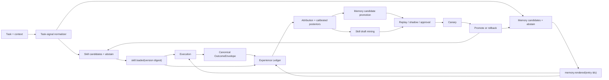

# MiniCode 持久化记忆与 Skill 路由自进化审查

> 状态说明：前半部分保留首次审查时的基线证据；P0 与 P1 的已实施修复及
> 最新验证结果分别记录在文末。当前代码已不再具有其中若干已关闭缺陷。

## 结论

MiniCode 目前更准确的定位是：

> 具备安全审批的持久化上下文、确定性检索、静态 Skill 推荐和较丰富的
> telemetry，但尚未形成可度量、可归因、可回滚的自进化闭环。

“感觉一般般”是符合实现现状的。问题不在于模块数量不够，而在于控制环的
执行器和反馈归因没有接通：

- Memory 确实会写、会检索、会注入、会记录整轮成功/失败；
- Skill 确实会发现、打分并展示给模型；
- 但 Skill 是否实际加载没有被记录，Skill 成败也没有回流；
- Memory 的成功反馈对生产检索排序几乎没有影响；
- 两个名为“Skill update”和“Memory persistence”的正反馈动作实际是 no-op；
- 没有真实任务分布上的 counterfactual / canary / rollback 机制。

按“自进化能力”而非“代码完整度”做启发式评分：

| 维度 | 评分 | 判断 |
|---|---:|---|
| 持久化与并发安全 | 7/10 | 三 scope、原子写、冲突检测、审批审计较完整 |
| Reflection 候选质量 | 4/10 | 证据链不错，但单次瞬态错误仍大量进入待审 |
| Memory 检索 | 6/10 | lexical 路径稳定、可解释；跨语言/零重叠缺口已被项目自己确认 |
| Memory 反馈学习 | 2/10 | 有计数，但整轮同奖惩、权重仅 0.005 |
| Skill 路由 | 3/10 | 静态启发式可工作，但低置信不 abstain，负样本明显误路由 |
| Skill 自进化 | 1/10 | 只有 proposal；无 usage/outcome/version/shadow/canary/rollback |
| 真实端到端评估 | 2/10 | Memory 有大量 synthetic gate；Skill 没有质量 holdout 或收益评估 |

综合约为 **3/10**。这是“有演化基础设施”，不是“Agent 正在有效自进化”。

## 已验证的现状

### 实际项目状态

当前 `.mini-code-memory/memory.json`：

- 条目：1；
- active：0；
- rejected：1；
- injection：0；
- outcome feedback：0。

因此这个项目当前没有任何可注入的持久化知识，也没有发生过一次 Memory
反馈学习。另有 53 条位于 `advanced_memory.json` 的旧/session 数据，但生产
代码不读取这个文件名；它们属于孤立存储，不会改变 Agent 行为。

### 用本次用户请求做生产等价探针

在注册真实 Tool capability 后：

| 请求 | Intent | Confidence | 路由结果 |
|---|---|---:|---|
| 本次完整中文审查请求 | unknown/unknown | 0.05 | minicode-study、TDD、pytest-debugging、safe-refactor、README |
| `审查持久化记忆和技能路由` | unknown/unknown | 0.00 | 几乎相同 |
| `给我讲个笑话` | unknown/unknown | 0.00 | 几乎相同 |

负向请求也稳定选出工程 Skill，说明当前 score 不能被解释为 task-skill
relevance。

### 测试

以下相关 suite 全绿：

```text
147 passed in 1.22s
```

覆盖 Skill router/discovery/proposal、Memory E2E/integration/regressions、
orchestrator 和 feedback controller。测试证明组件机制可运行，但现有 oracle
还把两个弱策略写成了预期行为：

- 无匹配时返回全部 Skill；
- ambiguous task 可以仅凭“系统当前有哪些 capability”产生正匹配。

## 严重问题

### S0 — Skill 正反馈执行器没有接通

`FeedbackController` 会产生 `recommend_skill_update`，但
`agent_loop.py` 只设置 `_pending_skill_update = True`。全仓没有消费者读取
并执行这个 pending 状态。

同一控制器的 `suggest_memory_persistence` 调用
`context_compactor._tool_budget.flush()`；`ToolResultBudgetManager` 没有
`flush()`，异常又被吞掉。它既没有持久化 WorkingMemory，也没有产生
Memory candidate。

结果是日志会显示“queued / persisting”，但未来行为完全不变。这是最典型的
“观测像闭环、执行仍开环”。

证据：

- `minicode/agent_loop.py:681-697`
- `minicode/feedback_controller.py:251-256`
- `minicode/context_compactor.py:153-276`

### S0 — Skill 没有实际使用和结果归因

当前只记录 `skill.routed`。它表示系统推荐了什么，不表示模型是否调用了
`load_skill`。RunJournal 没有 `skill.loaded`、Skill digest/version、
`skill.applied` 或 `skill.outcome`。

`tool.started(load_skill)` 最多能证明调用过 loader，但事件不保存输入，无法
知道加载了哪个 Skill。Task outcome 也无法关联到具体 Skill。因此不存在
训练 Skill router 所需的 `(task, selected, loaded, outcome)` 样本。

证据：

- `minicode/run_journal.py:87-106`
- `minicode/run_events.py:464-519`
- `minicode/tools/load_skill.py:14-38`

### S1 — 低置信路由没有 abstain，能力可用性被误当成任务需求

未知 intent 时，`_relevant_capabilities` 返回 registry 的全部可用
domains/scopes。随后 `_score_text` 在 Skill 自身 metadata 中找到这些 domain
词，产生正分。这个分数与用户任务无关，导致“讲笑话”也路由到 TDD。

另外：

- `ParsedIntent.confidence` 没有参与路由；
- 没有最低分、top-1/top-2 margin、负向证据或明确 abstain；
- fallback 忽略 `top_k`，返回全部 Skill；
- Skill frontmatter 的 `examples` 已被解析，却没有进入路由文本；
- 中文没有 review/memory 对应 pattern，也没有中文分词，整句成为一个 keyword。

证据：

- `minicode/skill_router.py:157-223`
- `minicode/skill_router.py:323-345`
- `minicode/skill_router.py:402-430`
- `minicode/intent_parser.py:77-95`
- `minicode/intent_parser.py:222-244`

### S1 — Memory 反馈是相关性奖惩，不是因果归因，而且决策权极弱

一轮注入多个 Memory 时，所有 rendered IDs 接受完全相同的整轮成功/失败
标签。系统不知道某条 Memory 被模型使用、被忽略，还是误导了执行。

即使累计出了 `usefulness_score`，canonical production ranking 的权重只有
`0.005`，词法分为 `0.72`。usefulness 从 -1 变成 +1，最终分最多变化 0.01。
反馈存在，但不足以改变绝大多数排序结果。

这也解释了为何直接把反馈权重调大并不安全：当前 credit assignment 本身是
混杂的，放大权重会放大误奖惩。

证据：

- `minicode/memory_pipeline.py:553-584`
- `minicode/memory.py:2783-2807`
- `minicode/memory_retrieval.py:601-629`

### S1 — 同一个 Run 有三套不一致的 outcome authority

- 返回任意非 progress 最终文本时，`turn_outcome = success`；
- 只要出现一次 Tool error，TaskState 就是 `FAILED`；
- SmartRouter feedback 也以 `tool_error_count == 0` 作为成功；
- Memory feedback 使用 `turn_outcome`。

于是“Tool 失败但 Agent 最终恢复并回答”的同一 Run 可以：

- 正向强化全部注入 Memory；
- 负向惩罚模型路由；
- 被 Task 状态记录为失败；
- Reflection 又带 `success` 标签保存错误模式。

当前唯一被用户拒绝的项目 Memory 正是
`provenance.success=true + reusable_error_pattern`。没有统一 outcome envelope，
联合学习一定会互相打架。

证据：

- `minicode/agent_loop.py:1619-1665`
- `minicode/agent_loop.py:1969-1976`
- `minicode/agent_loop.py:2024-2044`

### S1 — Curator 的“每 10 个任务”实际是每 10 个 Agent step

`MemoryPipeline.maintain()` 每调用一次都执行
`curator.on_task_complete()`；orchestrator 从 `step_end()` 调它。长任务内每个
Tool step 都在累计“task count”，达到 10 后会在任务尚未结束时运行归并、
stale validation、tier promotion 和 linking。

这会导致：

- cadence 与配置语义不一致；
- Memory 在同一任务中途被改写；
- 长任务比短任务获得更多 curator 权重；
- 性能和审计数据难以解释。

证据：

- `minicode/memory_pipeline.py:593-615`
- `minicode/cybernetic_orchestrator.py:291-300`
- `minicode/cybernetic_orchestrator.py:418-420`

### S1 — 单次瞬态错误被当作 durable reusable pattern

Rule synthesizer 会把任一“specific error”转成 `error_pattern`，同时明确写入
“只在一次任务中观察，尚未确认复现”。Value gate 又无条件把
`error_pattern` 映射为 `reusable_error_pattern`。

安全审批阻止了自动注入，这是正确的；但所有自动 reflection 又都必须人工
审核，所以这种候选会迅速制造 review fatigue。当前被拒绝的 web search
条目包含两个近重复瞬态错误及截断 retry note，正是该路径的现实样本。

证据：

- `minicode/reflection_synthesis.py:337-354`
- `minicode/reflection_synthesis.py:1063-1069`
- `minicode/memory_pipeline.py:465-510`

### S2 — 当前 SmartRouter 持久化改动没有闭合相邻模型路由

当前未提交改动给 `SmartRouter` 增加了 `router_feedback.json` 路径，这只能
解决“可能写到哪里”：

- 小于 10 条 outcome 时没有自动 save，退出时没有 flush；
- `route_and_switch()` 仍直接调用静态 `AgentRouter.route_task()`；
- `get_best_model_for_task_type()` 没被路由路径调用；
- `get_model_score()` 有 LRU cache，record outcome 后没有 invalidation；
- 学到的是模型全局平均，不是 task cluster 条件表现。

它和 SkillRouter 是两套独立 router，不能改善 Skill 选择。

证据：

- `minicode/cybernetic_orchestrator.py:138-146`（当前工作树改动）
- `minicode/smart_router.py:41-135`
- `minicode/smart_router.py:223-265`

## 做得好的部分

这些基础不应推倒重来：

- Memory 的三 scope、原子写、revision conflict、审批 hash、审计日志和删除
  边界都比较扎实；
- 自动 reflection 默认进入人工审批，而不是直接污染 prompt；
- canonical retrieval 有 selected/rendered/suppressed IDs、reason codes、预算和
  fail-closed 行为；
- Memory feedback 只允许本轮实际 rendered IDs，避免调用方任意奖励别的条目；
- 项目对 Memory lexical retrieval、contamination、reflection evidence 做了
  大量 synthetic/holdout 评估，并诚实记录了 37 个 semantic gap；
- hybrid adjudication 没有为了“看起来智能”而把不合格 embedding gate 上线。

这些能力很适合成为下一版闭环的安全壳。

## 建议的目标架构



核心约束：

1. **一个 outcome authority**  
   `OutcomeEnvelope` 至少区分：
   `request_completed`、`task_goal_achieved`、`tool_errors_recovered`、
   `verification_passed`、`user_accepted`、`cancelled`，禁止各子系统自行把
   “成功”压成一个 bool。

2. **路由可 abstain**  
   只有 task-derived signal 可以决定 route；registry availability 只能做
   compatibility filter。低置信、低分、margin 小都返回空 Skill 列表。

3. **实际使用必须可观测**  
   新增 `skill.loaded`，包含 `qualifiedName`、content digest、source、route
   rank；任务结束新增 versioned attribution record。

4. **Memory 先做 observation，再做 durable knowledge**  
   - 用户明确偏好/约束/纠正：可立即进入 review；
   - verified recovery/decision：一次强证据可进入 review；
   - transient error：先进入有 TTL 的 observation buffer，复现 N 次或形成
     error→recovery→verification chain 后再 review。

5. **Skill 只自动生成 draft，不自动成为 production instruction**  
   repeated successful trajectory → draft → static validation → historical
   replay → negative cases → shadow → user approval → canary → promote/rollback。

6. **版本化与回滚是 Skill 的一等字段**  
   每个 Skill 需要 `skill_id/version/digest/parent/status/created_from_runs/
   evaluation/rollback_to`，而不是仅靠可变的 `SKILL.md` 路径。

## 建议的实施顺序

### P0：先让控制环诚实、可测

1. 统一 `OutcomeEnvelope`，Memory、TaskState、model router 共用。
2. 把 curator 移到真正的 task-finalization；step 中只能做只读 observation。
3. SkillRouter 在 `unknown` 或低 confidence 时直接 abstain；fallback 返回空，
   不返回全部 Skill。
4. capability 只做“Skill 所需工具是否可用”的过滤，不能单独产生 relevance。
5. 加入本次中文请求、`审查持久化记忆和技能路由`、`给我讲个笑话` 三个回归
   case。
6. 删除未实现的 positive-feedback flag，或实现明确消费者；不再记录虚假的
   “queued/persisting”日志。

### P1：建立真实 attribution

1. 增加 `skill.loaded` / digest / version 事件。
2. 建 Experience Ledger，把 route、load、Memory rendered IDs、Tool/verification/
   user correction 和统一 outcome 关联到同一 Run。
3. 为 Skill 路由建立真实 bilingual/mixed/negative holdout；使用 frontmatter
   examples，先做中文 n-gram/领域同义词，不要直接重用已被拒绝的全局 embedding
   threshold。
4. Memory usefulness 改为带先验和样本量的 posterior；在 credit assignment
   改善之前，不要简单放大 0.005。
5. Dashboard 增加：candidate reject rate、route abstain、wrong route、Skill
   load rate、Memory helpful/harmful feedback、按版本的 outcome delta。

### P2：再做受控自进化

1. 从至少 3 次相似且 verified-success 的轨迹挖 Skill draft。
2. 对 draft 做 capability/safety/static checks 和历史 replay。
3. shadow 阶段只记录“本可选择该 Skill”，不注入 instruction。
4. 人工批准后小流量 canary；成功率、Tool error、成本、时延任一恶化即 rollback。
5. Memory promotion 与 Skill promotion 都保留 parent、证据、评估和删除传播。

## 应新增的验收指标

### Skill router

- Top-1 precision、coverage、abstain precision；
- negative wrong-route rate；
- 中英/混合语言分片差异；
- routed → loaded 转化率；
- loaded Skill 相对同类未加载任务的 goal-achievement delta；
- Skill version rollback rate。

### Memory

- observation → review → approve/reject 漏斗；
- 单次 transient error 进入 review 的比例；
- rendered Memory 的 explicit helpful/harmful rate；
- 多 Memory 同时注入时的 attribution coverage；
- 按 task cluster 的 success/tool-error/cost delta；
- active Memory 数量和“长期零反馈”比例。

### 自进化总门

任何自动 promotion 都必须同时满足：

- 独立 holdout 不退化；
- negative/harmful gate 通过；
- shadow/canary 证据存在；
- 版本、parent 和 rollback target 完整；
- 没有用户拒绝、删除或 correction 冲突；
- 提升来自真实 outcome，而不是仅来自更高 retrieval score。

## 最小可交付切片

如果只做一轮、希望最明显改善体感，建议只交付下面这个 tracer bullet：

1. 修复中文/unknown abstain；
2. fallback 返回空；
3. 新增 `skill.loaded`；
4. 统一 OutcomeEnvelope；
5. transient error 两次复现前不进入 Memory review；
6. curator 改到 task end；
7. 做一个 60–100 条真实/人工裁决的中英混合 Skill routing holdout。

这不会立刻“自动写新 Skill”，但会先把错误路由、噪声记忆和伪反馈去掉，
并产生下一阶段真正可学习的数据。对当前项目而言，这比继续增加更多 controller、
score 或 memory tier 更可能改善 Agent 的实际表现。

## P0 修复实施结果（2026-07-27）

本报告中的最小闭环已经实现：

1. Skill Router 对 unknown/无任务证据请求返回空列表；capability、tool
   availability、目录命中和 source bonus 只参与兼容性或排序，不能单独创造
   relevance。ASCII 词项改为边界匹配，避免 `audit` 误命中 `auditing`。
2. 中文审查/持久化记忆/Skill 路由请求可解析为 `review/analyze`，中英混合
   关键词可匹配 Skill；frontmatter `examples` 已进入路由证据。
3. `load_skill` 成功边界新增 `skill.loaded` 事件，只公开稳定名称、source、
   directory 和内容 SHA-256，不公开本地路径或 Skill 内容；Run Journal、
   Dashboard 严格投影和 UI 均已接通。
4. 新增 canonical task outcome，TaskState、审计、Memory feedback、model
   routing learner 和 pattern feedback 不再对同一任务给出互相冲突的成功/
   失败标签；已恢复的 Tool error 与任务目标成功分开记录。
5. Memory curator 从 step end 移到 task end；单次且未验证的 error/warning
   reflection 不再进入 durable review，同一任务内独立复现两次或存在
   confirmed recovery + passed verification 时才放行。
6. 删除了两个虚假正反馈 actuator：不存在的 memory `flush()` 和无人消费的
   `_pending_skill_update`；日志现在明确表示只观察到信号、没有获批执行器。
7. SmartRouter 反馈按项目存入 `.mini-code/router_feedback.json`，在任务结束
   时立即 flush 并清除评分缓存，避免任务文本和模型统计跨项目污染。持久化结果
   会在重启后参与同一静态 tier 内的重排，但只有至少两个候选在相似任务画像上
   各有 3 条观测时才生效；forced model、tier 和可用模型边界不被学习器越权。
   文件使用原子替换；POSIX 使用 owner-only `0600` 权限。Windows 沿用父目录
   ACL，本评审未独立验证 owner-only DACL。未知模型结果不进入学习集。

生产等价探针结果：

- 原始中文审查请求：`review/analyze`，confidence `1.0`，命中
  `minicode-study`、`safe-refactor`、`minicode-learning-coach-demo`；
- “审查持久化记忆和技能路由”：同样稳定命中上述相关 Skill；
- “给我讲个笑话”：`unknown/unknown`，返回空 Skill 列表并标记 abstain。

验证结果：相关回归 `341 passed`；完整测试
`3340 passed, 2 skipped, 3 existing benchmark-marker warnings`。

尚未完成的 P1/P2：

- `skill.loaded` 已提供真实使用观测，但尚未建立按 Skill 版本的 outcome
  attribution、holdout、shadow/canary、promotion 和 rollback。
- Memory usefulness 仍是 whole-turn 粗粒度反馈，排序权重仍很低；尚未实现
  多 Memory 的因果 credit assignment。
- transient error 当前只支持同任务复现门槛，尚无跨任务、带 TTL 的
  observation buffer。
- legacy `advanced_memory.json` 仍是孤立命名空间，尚未迁移或清理。

## P1 Skill 使用结果归因实施结果（2026-07-27）

P1 已把“路由候选”与“实际使用”进一步分开，并建立同一 Run 内的任务级
相关性记录：

1. 每个 `run_agent_turn` 创建独立的 `SkillUsageTracker`，通过所有串行和并发
   `ToolContext` 传入真实 `load_skill` 边界，不使用进程全局状态。
2. 成功加载后按
   `(qualifiedName, source, directory, contentDigest)` 去重。重复加载仍各自记录
   真实 `skill.loaded` 事件，但任务归因只保留一个唯一版本；记录最多包含
   20 个 Skill，并显式标记截断。
3. 任务 finalization 使用唯一 canonical outcome 生成
   `skill.attributed@v1`，字段区分任务成功、是否发生 Tool error、错误是否已
   恢复及错误数量。`attributionKind=task_correlation` 明确声明这是相关性证据，
   不是因果结论。
4. `RunJournal` 中的真实顺序已验证为所有 `skill.loaded` 先于
   `skill.attributed`，终态 `run.completed` 最后写入；加载与归因没有跨 Run
   拼接。
5. Dashboard 只有在完整校验版本、枚举、布尔一致性、计数、Skill 名称、
   source、directory 和 SHA-256 后才返回白名单字段。任务文本、模型响应、
   Skill 内容和本地路径即使混入原始 payload 也不会被展示。
6. 通用 Run 事件列表分别展示路由、加载和任务相关结果；专用 Skill Routing
   面板仍只表示候选路由，避免把“被推荐”“被加载”“导致成功”混成一个概念。

这一步对自进化的实际价值是：系统现在能按 Skill digest 计算真实
`routed → loaded` 转化、加载后的任务结果和已恢复错误，而不再用
`skill.routed` 冒充使用样本。它建立了后续评估与受控学习所需的数据面。

但当前仍不能从单条 `skill.attributed` 推断 Skill 有效：

- outcome 仍是整项任务标签；同轮加载多个 Skill 时存在共同归因混杂；
- 没有相似任务下的未加载对照、counterfactual 或随机 holdout；
- 尚未纳入 verification、用户接受/纠正、成本和时延作为晋升门槛；
- digest 提供不可变版本身份，但还没有 `parent/status/rollback_to` 版本账本；
- 没有跨 Run 聚合的校准 posterior、shadow、canary、promotion 或 rollback。

因此 P1 的准确评价是“从盲路由进入可信可观测”，而不是“已经会自动进化”。
任何自动 Skill 打分或晋升仍保持关闭，直到上述因果评估和回滚门建立。

验证结果：

- 聚焦 runtime/Journal/Dashboard/Agent/lifecycle 回归：
  `177 passed in 33.79s`；
- 兼容性收紧后的核心回归：`82 passed in 0.64s`；
- 完整测试：
  `3348 passed, 2 skipped, 3 existing benchmark-marker warnings in 194.87s`；
- `ruff`、Python `compileall`、`node --check` 和 `git diff --check` 均通过。

## P2A 跨 Run Skill 影子证据账本实施结果（2026-07-27）

P2A 已把 P1 的“单次任务相关性”扩展成受限、只读、跨 Run 的可比较证据：

1. 每个被观察的 Agent task 都写入唯一 `task.outcome@v1`，包括没有加载
   Skill 的任务；treatment 与 control 因此共享同一 canonical outcome
   语义，不再用 `run.completed` 猜任务是否成功。
2. Skill 发现阶段在既有文件读取中计算内容 SHA-256，然后继续丢弃正文；
   新的完整路由观测写入 `skill.routed@v2`。路由与真实 `load_skill` 使用同一
   digest 身份，历史 v1 仍可展示，但不进入版本级比较。
3. `SkillEvidenceLedger` 隐藏 RunJournal 分页、事件校验、跨 Run join、样本
   上限和统计实现。它最多扫描最新 200 个 Run、每 Run 500 个事件，并最多
   返回 100 个评估项。
4. treatment 只接受一个实际加载 Skill，且必须满足：
   路由 digest 匹配、唯一一致归因、binary canonical outcome，以及
   `route → load → outcome → attribution` 的真实顺序。
5. control 必须在相同 `intentType/actionType` 下路由过同一 Skill digest，
   但没有加载、归因或失败的 `load_skill` 尝试。多 Skill、直接加载、
   digest 不匹配、旧 v1、非 binary outcome、事件损坏或读取不完整均显式
   排除。
6. treatment/control 各至少 5 条后才打开样本门；使用 Wilson 95% 区间区分
   `positive_signal`、`negative_signal` 与 `inconclusive`。任一队列为空时
   delta 为 `null`，不制造表面提升。
7. Dashboard 只展示有界聚合、排除计数、digest、粗粒度任务画像、区间和
   shadow status。面板明确标注“task correlation, not causal proof”与
   “promotion locked”；证据读取失败不会让 Skill catalog 一起不可用。

生产等价测试已经覆盖完整链路：创建真实项目 Skill，经发现和路由后执行 5 个
真实加载 treatment 与 5 个 no-load control，再从持久化 Run 推导影子信号。
该测试也验证任务标题、Skill 正文和路径不会进入账本结果。

最终验证：

- P2A 聚焦与 Dashboard/Gateway 回归通过；
- 已安装 wheel 的 Dashboard/事件观测烟雾测试通过；
- 完整测试：`3365 passed, 2 skipped, 3 existing warnings in 195.21s`；
- `ruff`、`compileall`、`node --check`、`git diff --check` 全部通过。

这一步对自进化的真实提升是：Agent 首次拥有“某个不可变 Skill 版本在相似任务
中，与未加载该 Skill 相比是否呈现稳定差异”的可审计数据面。它解决了之前
只有 route/load 单点日志、无法跨任务判断的核心问题。

但它仍不是因果证明，也不会自动进化：

- 路由、模型选择和任务难度没有随机化，仍存在 selection bias；
- 任务画像只有粗粒度 intent/action，不能消除未观测混杂；
- outcome 尚未加入独立 verification、用户接受/纠正、成本与时延门；
- 还没有 Skill `parent/status/created_from_runs/evaluation/rollback_to`
  版本账本；
- 没有 replay、独立 holdout、shadow candidate、人工批准、canary 与
  自动 rollback 状态机。

因此所有结果固定为 `mode=shadow`、`promotionEligible=false`，且没有任何
调用方把它反馈给实时 SkillRouter。下一步 P2B 应先建立一等 Skill version
ledger 与 verification/user/cost/latency gate，再谈 replay、canary 和
rollback；不应直接把 P2A 的相关性分数接入自动晋升。

## P2B Skill 版本与晋升门禁账本实施结果（2026-07-27）

P2B 已建立一等、项目级、内容安全的 Skill version ledger，但仍保持纯观测和
只读评估：

1. 运行时真实 Skill catalog 首次看到某个 digest 时，原子追加一个
   `observed` 版本，只保存 qualified name、source、directory、SHA-256、
   deterministic version ID、首次观测时间和 parent；不保存正文、路径或任务
   文本。
2. 同一个 Skill 的新 digest 必须严格指向紧邻前版。断 parent、跳过中间版、
   cross-Skill parent、重复 ID、乱序或损坏历史都会让账本 fail closed，运行时
   不会用新数据覆盖可疑历史。
3. 存储位于项目 `.mini-code/skill_versions.json`，采用进程锁、POSIX 文件锁、
   临时文件 `fsync + replace`、1000 版本和 2 MiB 上限。POSIX 文件使用 `0600`
   权限；Windows 沿用父目录 ACL，本评审未独立验证 owner-only DACL。符号链接
   根/文件、非目录根和非普通文件均被拒绝，避免状态被重定向到 Workspace 外。
4. P2A cohort 新增精确 Cost/latency coverage。Cost 只接受每个完成模型操作的
   唯一 canonical priced 事件；latency 只接受完整 started/terminal 配对和有界
   duration。Cost 损坏只降级 Cost，不抹掉独立可信的 latency。
5. 每个版本展示 outcome、verification、user、cost、latency 五道门。outcome
   只接受已过样本门的正信号且不得存在 sampled negative/inconclusive；Cost 和
   latency 要求 treatment/control 覆盖完整且均值不回退。
6. 当前没有独立 verification 和任务后用户接受/纠正的 canonical 事件，因此
   这两道门如实为 `unavailable`。它们不会由 task success、Tool success、
   permission 或 reflection 伪造。
7. Dashboard 的 catalog、P2A evidence 和 version history 三个来源独立失败隔离；
   只展示 digest 谱系、current/historical、五门状态与显式
   `promotion locked / rollback execution locked`，没有任何写操作。

最终验证：

- 存储、证据、读模型和 Tool 聚焦回归：`115 passed`；
- Dashboard HTTP 与 installed-wheel packaging：`80 passed`；
- 完整测试：`3381 passed, 2 skipped, 3 existing warnings in 196.42s`；
- Python compile、前端语法、diff whitespace 和 P2B touched-file Ruff 全绿。

Functional Reliability Audit 1A 仍如实报告七个既有基线缺陷，其中
`MEM-001` 表示普通会话事实尚未形成可审批、可跨 Session 检索的生产入口；
其余是 archive、read-file、validator 和 Tool-error 安全/真实性问题。它们没有
被 P2B 掩盖，也不属于版本门禁账本的修复范围。

P2B 对自进化的提升在于：系统现在知道“证据属于哪个不可变 Skill 版本”，并能
在不修改实时路由的前提下拒绝 outcome、成本或时延回退。它仍不是自动晋升。
下一步 P2C 应先增加内容安全的独立 verification 与显式用户接受/纠正事件，
再做 replay/holdout shadow；在这些门具有真实生产覆盖前，canary、promotion
和 rollback actuator 应继续锁定。
